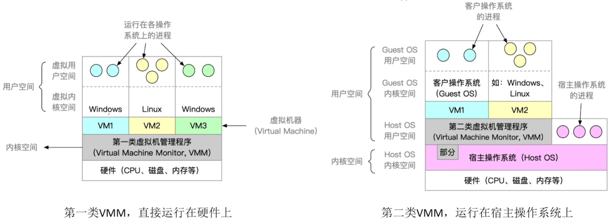
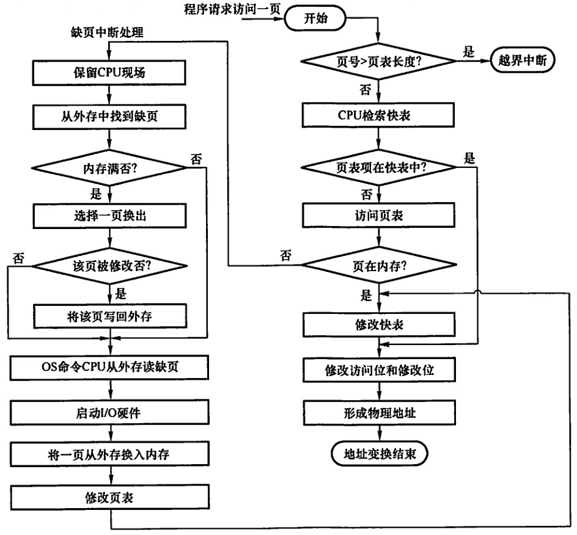
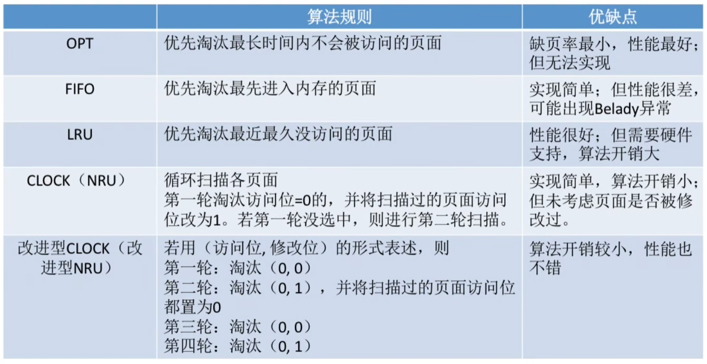
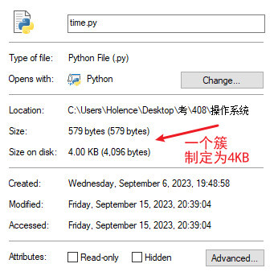

# 一、绪论

操作系统，控制管理硬件、软件资源，为上层用户、应用提供简单易用的服务。

- 联机命令接口（输一句执行一句，CMD）
- 脱机命令接口（输入一堆执行一堆，bat）
- 程序接口（系统调用）

## 操作系统的发展

1. 手工操作阶段：手工打孔纸带，一个人一个人操作机器读取、处理、输出

   > 用户独占全机，人机速度矛盾导致资源利用率极低

2. 单道批处理系统：脱机输入输出技术，由一个外围机的监督程序负责输入输出，把多个用户的多段打孔纸带程序提前写到磁带上，计算机直接快速读取磁带上的信息，处理后输出到磁带，再由监督程序输出

   > 减少了输入输出的时间，提升了资源利用率
   >
   > 但依旧是串行运行，依旧有大量的I/O时间CPU是空闲的

3. **多道批处理系统**：多道进程按流水线的思想并行分配主机的各个部件，多道程序并发执行，共享计算机各部件的资源

   > 效率大幅提升
   >
   > 不能中断，不能人机交互

4. 分时操作系统：一个主机+多个终端。以时间片为单位轮流给各个用户提供服务

   > 可以中断，可以人机交互，允许同时给多个用户提供服务
   >
   > 不能优先处理一些紧急的任务

5. 实时操作系统：要求在时限内处理完事件，要有及时性、可靠性

   - 硬实时系统：必须严格在规定时间内完成（导弹控制系统、自动驾驶系统）
   - 软实时系统：允许偶尔超时（火车订票系统）

6. 其它

   - 网络操作系统：专门服务于网络的资源共享、通信
   - 分布式操作系统：多台计算机分布、并行地完成任务
   - 个人计算机操作系统：方便个人办公、娱乐

## 操作系统的特性

### 并发

CPU时分复用的并发，是操作系统最基本的特性（我们更多的要研究分时操作系统以后的东西）

并发vs并行


并发性造就了共享、虚拟、异步的特性

### 共享

- 互斥共享：一段时间只允许一个进程访问[临界资源](#进程互斥)（比如打印机只能允许给一个进程，不然并发多个进程都要打印，打印出来的就混在一起了）
- “同时”共享：一段时间多个进程并发地访问资源（比如文件读取，可以“同时”复制两份）

并发和共享互为存在条件

### 虚拟

- 虚拟存储器：空分复用
- 虚拟处理器：时分复用

### 同步/异步

异步指“多个程序并发执行，各个进程的执行走走停停，以不可预知的速度向前推进”的现象

异步会造成相互关联的进程的数据出错的问题（比如读写矛盾）

又由于需要对临界资源进行互斥访问

所以需要通过人为设计[同步](#进程同步\互斥问题)来解决这些问题

## 操作系统的运行

- 内核程序：操作系统的内核
- 应用程序：普通的软件

CPU的PSW中有一位是区分运行状态的，内核态 or 用户态，用以划分内核程序\\应用程序的操作权限（有些指令过于危险，不能让应用程序操作）

- 内核态（核心态\\管态）->特权指令
- 用户态（目态）->非特权指令

当需要运行应用程序时，内核程序发一条特权指令给CPU，修改PSW到用户态

如果在运行应用程序时，CPU发现当前的指令为特权指令或其它非法事件或系统调用，就会触发中断，硬件操作变回核心态，再进行一些处理中断信号的内核程序，处理完后才交还权限运行剩下的应用程序。

### 异常与中断

- 内中断（异常）：来自CPU内部的中断
  - 故障：
    - 非法操作码，用户态的特权指令
    - 非法事件，比如除数为0、地址越界、溢出、缺页等
  - 陷入（陷阱，访管），应用程序需要请求系统调用（内核服务）
  - 终止：硬件故障，不可恢复，终止应用程序
- 外中断（中断）：来自CPU外部的中断
  - 时钟中断（CPU外的定时器），用于实现多道程序系统的并发
  - I/O中断

### 原语

具有原子性，一气呵成地操作完

由关中断和开中断包裹的一串指令

用于安全地完成一些内核操作

### 系统调用

为了保证系统的稳定性、安全性，应用程序对共享资源有关的操作需要通过系统调用的方式向内核提出请求（打印到屏幕、写文件这些高级语言的库函数都是对系统调用`write`的进一步封装）

- 设备管理
- 文件管理
- 进程控制
- 进程通信
- 内存管理

具体流程如下


## 操作系统的结构

- 模块化：分模块开发，互相提供接口

  > 优点：
  >
  > - 可动态加载新的内核模块（比如安装设备驱动程序），可适应性高
  > - 任何模块之间可直接调用，效率高
  >
  > 缺点：
  >
  > - 模块间互相依赖，难调试

- 分层式：每层只能单向调用更低层所提供的接口

  > 优点：
  >
  > - 便于逐层开发、调试
  >
  > 缺点：
  >
  > - 不能跨层调用，效率低

- 宏内核：所有的都划为核心

  > CPU状态的转换次数少，执行速度快
  >
  > 不容易扩展，单个子服务崩溃意味着整个系统的崩溃

- 微内核：最接近硬件的部分、最基本的功能划为核心，其它的算在用户态里

  - 足够小的内核
  - 客户/服务器模式
  - 机制与策略分离
  - 面向对象

  > CPU状态的转换次数多，执行速度慢
  >
  > 容易扩展，单个子服务崩溃不影响其它服务

  

- 外核：可直接为应用程序分配、管理未经抽象的硬件资源（不是虚拟的分散的，而是连续的存储空间）

  > 减少虚拟所需的映射操作，提升效率
  >
  > 但降低了系统的一致性

## 安装操作系统

1. 对磁盘进行**物理格式化**（低级格式化）：磁盘的厂家将磁道划分为扇区
2. 对磁盘进行**分区**：将一个磁盘划分为多个分区
3. 在某个分区中进行**逻辑格式化**（高级格式化）：安装文件系统
4. 在某个分区中**安装操作系统**

## 操作系统的启动


windows的启动管理器："C:\Windows\Boot\PCAT\bootmgr"

> - 旧的：Legacy+MBR (Master Boot Record)
> - 新型：UEFI+GPT (GUID Partition Table)
>
> ```cmd
> diskpart.exe #windows的程序
> list disk # 可以查看是GPT还是MBR
> select disk 0
> clean
> convert mbr
> convert gpt
> ```

## 虚拟机

VMM (Virtual Machine Monitor)




# 二、进程与线程

## 进程

进程指进程实体的运行过程（动态表现），是系统进行资源分配（内存、I/O设备）、CPU调度的基本单位。（先不考虑线程）

一个进程实体（进程映像）存在内存中，由哪些部分构成？

- 进程实体
  - 进程控制块 PCB (Process Control Block)（给操作系统用的）
    - 进程描述信息
      - 进程标识符 PID
      - 用户标识符 UID
    - 进程控制和管理信息
      - 状态（创建/就绪/运行/阻塞/结束）
      - 使用情况统计（CPU、磁盘、网络流量）
    - 资源分配清单（正在使用的文件、内存、I/O设备）
    - 处理机相关信息（PSW、PC、SP等寄存器的值，用于进程切换）
  - 程序段：指令序列（给进程用的）
  - 数据段：临时变量（给进程用的）

特征：

- **动态**
- 并发
- 独立
- 异步
- 结构

UNIX中，进程的创建具有层次结构，允许一个进程创建另一个子进程，子进程继承父进程的资源。Windows中，进程的地位完全相等，但可以通过句柄（Handle）来控制其它进程，所以只有控制与被控制的关系。

### 进程的状态切换

进程的生命周期有五种状态

- 创建/新建
- 就绪
- 运行
- 阻塞/等待
- 终止/结束


还有可能有挂起状态，当内存不够用时，就会把就绪态、阻塞态的不活跃的进程存到外存中

---

操作系统根据状态进行统一管理：

- 链接方式：同种状态的按优先级串成队列，阻塞的可以按照阻塞原因更加细分
- 索引方式：索引表（类似字典）

> 管理每一种状态都有一个指针指向队首
>
> 单CPU的情况下，运行态的进程只可能有一个

---

操作系统控制进程（各种状态间的切换）是通过各种~~咒语~~原语：

<u>详细过程不需要背，理解就好！</u>

- 创建原语（创建/就绪）

  > 申请空白PCB，初始化PCB，分配资源，若资源足够，创建成功则插入就绪队列，否则保持创建态。

- 切换原语（运行->就绪 \\ 就绪->运行）

  > 分时复用的并发
  >
  > 撤下：保存寄存器信息到PCB中，移入就绪队列尾部。
  >
  > 换上：开始运行就绪队列首部的PCB，恢复其寄存器信息。

- 唤醒原语（阻塞->就绪）

  > 找到该PCB，设为就绪态，放到就绪队列。

- 阻塞原语（运行->阻塞）

  > 找到该PCB，保护现场，设定为阻塞，暂停运行，插入到阻塞队列。

- 撤销原语（就绪/阻塞/运行->终止->无）：

  > 找到该PCB，剥夺CPU，终止该进程和子进程，将该进程拥有的所有资源归还给父进程，删除PCB。

大致都是这几个操作：

1. 更新PCB的信息（修改进程状态，保护/恢复运行环境）
2. 将PCB转移到对应的队列
3. 分配/回收资源

### 进程间的通信

为了安全，在内存中进程不能直接访问其它进程的地址空间

所以为了实现进程间的数据交换，操作得提供通信方法

- 共享存储：在内存中划分一块共享的地址空间

  - 基于数据结构的共享：划分出来的地方只能存固定大小的某种数据结构

    限制多、速度慢、低级的通信方式

  - 基于存储区的共享：划分一整块地方，数据的形式和存取的位置都由进程自己决定

    限制少，速度快，高级的通信方式

  > 各个进程对共享空间的访问应该是**互斥**的，可以通过同步互斥工具（PV操作）实现

- 管道通信：在内存区中建立的单向（半双工）的固定大小的管道（一进一出或多进一出，先进先出的队列）

  > 也需要互斥地访问
  >
  > 当写满时，写进程阻塞，直到读进程取出一条数据
  >
  > 当读空时，读进程阻塞，直到写进程写入一条数据

- 消息传递：以格式化的消息为单位，通过操作系统“发送消息/接收消息”的原语来通信

  - 直接通信：发消息的指明接收方，消息存到操作系统记录的接收方的PCB的消息队列中，等待接收方接收
  - 间接通信：发消息到操作系统的信箱中，根据情况决定是否要指明接收方。可以一对一（私密通信），可以一对多（客户/服务器模式），可以多对多（公用信箱）

## 线程

以前的软件只能串行地执行任务，就比如我的软件（不搞QThread的话）在做I/O任务时，界面就卡死不能动了。现代的软件大都是多线程，Telegram作为一个进程，拥有多个线程，可以一边下载文件一边看视频一边聊天。

所以为了减小程序在并发执行时的时空开销，想让一个进程能包含交替执行的多个子程序（在进行耗时的I/O操作的同时，也可以进行其它普通的任务），并且是在一个地址空间内（共享资源，线程可以访问父进程的资源，不用切换运行环境）。

当操作系统引入线程后

- 进程依旧是资源分配（内存、I/O设备）的基本单位，但线程成了CPU调度的基本单位

  > 同一进程内的线程共享进程的资源，通信也不需要操作系统干预

- 各个进程依旧可以并发，各个线程也可以并发

- 如果是在同一进程内切换线程，则不需要切换进程的运行环境，系统开销变少了

> 对于没有多个线程的进程，被算作单线程的进程来对待
>
> 多核CPU，同一进程的多个线程可以占用不同的核

和进程一样，操作系统控制和管理线程，也有一个线程控制块 TCB (Thread Control Block)，内部存储的信息也类似PCB。

状态以及状态切换也类似进程。

### 线程实现的发展

在操作系统还没有支持线程的内核时，最简陋的多线程就是循环体中按顺序执行一系列的任务（比如游戏的一帧内先读输入再运算最后渲染），也有的高级语言自带线程库。

当操作系统的内核有TCB之后，一个线程占用一个TCB。

1. 用户级线程 ULT (User Level Thread)

   线程管理工作由应用程序完成，切换线程时CPU在用户态

   > 线程的切换完全由应用程序管理，不需要环境切换、CPU状态切换，系统开销小
   >
   > 当一个线程阻塞后，整个进程就阻塞了（实际工程中，应用程序会采用非阻塞的访问来避免这种问题）。且在多核CPU中，无法将线程分配到多个核进行并行。

2. 内核级线程 KLT (Kernel Level Thread)

   线程管理工作由操作系统内核完成，切换线程需要CPU在核心态

   > 一个线程阻塞后，别的线程可以继续执行，并发能力强。可以多核并行。
   >
   > 一个用户进程的多个线程会占用太多内核线程，导致依次运行多个进程时，环境切换、CPU状态切换过于频繁，系统开销大

3. 组合方式：一个进程内的几个线程申请几个TCB，具体看软件的实现

   

## 处理机调度

资源有限，需要设计调度算法，根据进程的特质，分配内存、CPU给进程

- 作业调度（高级调度，长程调度，最低频）：将外存中处于后备队列的作业（需要创建进程的程序），调入内存
- 内存调度（中级调度）：将内存中暂时无法运行的进程调到外存中进行等待（挂起状态），以及适时再调度回到内存
- 进程调度（低级调度，短程调度，最高频）：将就绪队列的进程调入CPU

这里主要关注进程调度

### 性能指标

调度希望越大越好：

- $CPU利用率 = \frac{忙碌时间}{总时间}$
- $吞吐量=\frac{完成作业量}{花费时间}$

调度希望越小越好：

- 周转时间 = 作业提交 到 完成
  - 平均周转时间
  - $带权周转时间=\frac{周转时间}{CPU实际运行时间}$
  - 平均带权周转时间
- 等待时间：有关调度的等待时间（不包括阻塞的时间）（注意区分作业/进程等待时间，$作业等待时间 = 作业调度的等待时间+进程等待时间$）
  - 平均等待时间
- 响应时间 = 用户请求 到 响应

饥饿：长期得不到服务

### 进程调度

~~调度发生的时机~~

- ~~创建新进程~~
- ~~主动放弃：正常终止、异常终止、阻塞~~
- ~~被动放弃：时间片用完了、中断、有更高优先级的~~

调度的方式

- 非抢占式（非剥夺调度方式）：正常终止、异常终止、阻塞
- 抢占式（剥夺调度方式）：时间片用完了、中断、有更高优先级的

不能进行调度的情况：中断处理、原子操作（原语）、当前进程在访问内核数据结构（内核级别的临界资源）时

就绪队列空，CPU无事可干时，调度闲置（idle）进程。

### 进程调度算法

🤮又无用又繁琐，考你大爷

与[I/O设备调度](#I/O设备分配与回收)类似

早期的单道批处理系统，没有时间片的并发：

- 先来先服务
- 短作业优先
- 高响应比优先

后来的分时操作系统，更注重响应时间、平衡性，需要时间片的并发：

- 时间片轮转
- 优先级调度
- 多级反馈队列调度

多级队列调度

#### 先来先服务

FCFS (First Come First Serve)

可用于作业/进程调度

**非抢占式**，等主动放弃处理机才能调度，等待时间长的先服务

> 不会导致饥饿（迟早会排到）
>
> 优点：公平、算法实现简单
>
> 缺点：对长作业有利，对短作业不利（短作业的可能要等很长时间，带权周转时间会很大）
>
> 类比奶茶店卖奶茶，一个混蛋点了100杯，后面的人只能等……

#### 短作业优先

SJF (Shortest Job First) 面向作业的

SPF (Shortest Process First) 面向进程的

可用于作业/进程调度

默认为**非抢占式**，等主动放弃处理机才能调度，即先服务运行时间最短的（运行时间是预测的，可能不准）

> 会导致饥饿（先进来的长进程可能会被短进程耗死）
>
> 优点：平均等待时间、平均周转时间最短
>
> 缺点：对短作业有利，对长作业不利

也可以抢占式，即在有新进程就绪时，评估剩余运行时间，先服务剩余运行时间最短的（这比非抢占式的平均等待时间、平均周转时间更短）

#### 高响应比优先

HRRN (Highest Response Ratio Next)

可用于作业/进程调度

综合考虑等待时间和运行时间

$响应比 = \frac{等待时间}{预测的运行时间}+1$

（没用的加一，只是为了让结果大于等于1）

**非抢占式**，先服务响应比大的

> 不会导致饥饿
>
> 综合了“先来先服务”和“短作业优先”的优点

#### 时间片轮转

RR (Round Robin)

只用于进程调度

划分时间片搞并发

**抢占式**（<u>这里的抢占并不需要在有新进程就绪时就调度</u>），就绪队列队首的进程上机运行，执行完时间片的进程 和 新创建的进程 放到就绪队列的队尾（运行可以比时间片先结束）

时间片的大小得适中。若比所有进程的运行时间都长，则相当于先来先服务；若太小，则导致进程的环境切换过于频繁，系统开销大。

> 不会导致饥饿
>
> 公平，响应快，适合分时操作系统

#### 优先级调度

按优先级

非抢占式：等主动放弃处理机才能调度

抢占式：有新进程就绪时调度

同等优先级，按先来先服务

> 会导致饥饿（低优先级的可能很长时间等不到）
>
> 优点：
>
> 可灵活调整顺序
>
> 缺点：
>
> 低优先级的可能很长时间等不到

> 可以静态固定优先级：系统 > 前台 > I/O > 后台
>
> 可以动态调整优先级：等待时间越长优先级变大，已运行的时间越长优先级变小

#### 多级队列调度

弄多个类别的就绪队列，每一个队列的优先级不同、调度算法也可以不同，队列内进程优先级也可以不同。

#### 多级反馈队列调度

抢占式：有新进程就绪时调度

综合了先来先服务、时间片轮转、优先级调度的优点

优先处理先来的、处理时间短的、优先级高

时间片用完还没运行完的，退到更低一级的队尾。更低一级，表示已花费的时间长，那么以后分配到的时间片也会更长。

时间片没用完或者阻塞了，重排到本级的队尾。

也可以根据优先级灵活调整


> 会导致饥饿（低层级的可能很长时间等不到）

### 进程互斥

> 🤮一开始不弄阻塞队列，搞了一堆自旋锁跟傻逼一样，各种方法重复来重复去也说不灵清，后面就突然就可以阻塞了，然后就天下太平了？？？……搞得好像前面都是古代人只能用笨方法搞互斥的废铜烂铁，到后来才有了阻塞，那尼玛还花那么多篇幅讲那些垃圾？？？

在有时间片的并发调度中，想互斥地访问临界资源

临界资源：在并发中被争夺的资源，应该采取**互斥**的方法共享。一段时间只允许一个进程访问资源（比如打印机只能允许给一个进程，不然并发多个进程都要打印，打印出来的就混在一起了）

临界区：

```
一个进程的代码 {
	进入区：检查临界资源是否可访问，若可以，则上锁
	临界区：访问临界资源的部分
	退出区：解锁
	剩余区：后续处理
}
```

应该实现的目标：

- 空闲让进：若临界资源空闲，则进入
- 忙则等待：若临界资源被锁，则等待
- 有限等待：等待的时间有限，防止“饥饿”
- 让权等待：等待的时候应该释放CPU，不应该“忙等”

#### 软件实现

因为并发，所以进程在每句代码执行完都可能被随机地赶下台，所以在进入区中的检查与赋值中必须保证锁的完备性，即避免“同时无锁都去访问”和“同时被锁都干瞪眼”

- 单标志法❌

  > 那些被锁在外面等待的，在不停地while死循环，无法实现“让权等待”，导致“忙等”，也称为自旋锁

- 双标志法❌

- Petersons算法✅：互相礼让对方，最后一个礼让的肯定得让着别人

#### 硬件实现

所以在进入区中的检查与赋值通过原语实现

- 中断屏蔽：用关中断、开中断包裹。关中断导致无法进行进程切换，该进程得以顺序执行完。

  > 因为不能切换进程了，并发就无了，执行效率明显降低。
  >
  > 也不适用于多核CPU，因为关中断只关了一个

- TestAndSet指令（TSL指令）：有一个共享的Bool锁，进入区`while(TestAndSet());`返回是否上锁，不管是否上锁都设置为上锁。退出区里设为解锁。

  用原子操作把软件实现中的上锁与检查一气呵成地完成了。

  Swap指令逻辑上和TestAndSet一样

  > 无漏洞，且适用于多核CPU
  >
  > 依旧无法实现“让权等待”，导致“忙等”，因为硬件指令是原语，一直在while循环也不可能被打断
  
- 互斥锁acquire\\release。可以阻塞？还是死循环自旋锁？？


#### 信号量机制

一种由操作系统提供的原语

资源量为 S=1 表示初始有一个可用的资源

进入区申请资源的过程为P (proberen) 或 `wait()`

退出区释放资源的过程为V (verhogen) 或 `signal()`

- 整型信号量：

  P中`while(S<=0);`自旋锁，若没被锁，则S--；

  V中S++；

- 记录型信号量：

  莫名其妙就有了阻塞的功能，为什么前面那么多傻逼没有？？？

  `S.value`记录资源量，`S.list`记录阻塞的进程队列

  P中`S.value--`，若`S.value<0`则阻塞

  V中`S.value++`，若`S.value<=0`则唤醒`S.list`的队首进程

  > 好了嘛，终于搞出个阻塞
  >
  > 不用忙等了
  >
  > 蹲坑蹲半天，终于拉出来了

#### 封装实现

管程：高级语言中wait/signal的关键字，编译器自动帮你做好的阻塞排队互斥

### 进程同步\\互斥问题

对于需要互斥访问的问题，用信号量机制，设置信号量mutex的初值为1，也就是0-1两种状态的变化

同样可以利用信号量机制来实现同步，以解决异步的问题

如何设定尽可能少且合理的信号量（锁），需要动脑筋。<u>一般把临界资源的状态设为信号量</u>，而不是把对临界资源的操作设为信号量

对于解决异步访问资源的问题，设置信号量的初值为该资源的初值n

#### 前驱

进程间存在依赖关系，用信号量机制，设初始资源量为0，在前驱任务做完的地方调用V使资源变为1，在后继任务做之前调用P申请资源


#### 生产者-消费者问题

生产者和消费者中间用一个缓冲区中介

- 缓冲区空则需要消费者阻塞
- 缓冲区满则需要生产者阻塞
- 且需要互斥地对缓冲区存取


若缓冲区的大小为1，可以不用设置mutex

> 多类生产者-多类消费者
>
> 例：一个缓冲区，缓冲区大小为1，mom生产orange，son消费orange，dad生产apple，daughter消费apple
>
> 

#### 读者-写者问题

- 多个读进程可以同时（并发）读同一个文件
- 写操作，必须对其它写进程和所有读进程都互斥

写与其它都互斥，但读与读不互斥。

设计一个读写锁，信号量初值rw=1，读和写都要申请这个。

设立一个初值为0的count，记录正在读的进程的数量，若count>0就不用申请rw了，而归还锁的任务由最后一个离开的读进程去做（count==0的时候）。

想象图书馆的钥匙，第一个读书人开了门，之后来的直接进就行，最后走的人记得关门归还钥匙。

由于代码在实现对count的检查与赋值时用了多条语句，为了保证一气呵成，再设置一个mutex锁包裹。


#### 哲学家进餐问题


拿起两边的筷子才能吃饭，图中的代码会导致死锁

资源分布在两侧，且首尾相接

如果并发地每人都拿起了左边的筷子，就死锁了，没人能继续下去

三种解决方法：

1. 最多允许四个人拿筷子

   ```
   semaphore count=4;
   semaphore chopstick[5]={1,1,1,1,1}
   Pi(){
   	while(1){
   		P(count);
   		P(chopstick[i]);
   		P(chopstick[(i+1)%5]);
   		吃饭;
   		V(chopstick[i]);
   		V(chopstick[(i+1)%5]);
   		V(count);
   		思考;
   	}
   }
   ```

2. 拿起两边筷子的操作是一气呵成的

   ```
   semaphore mutex=1;
   semaphore chopstick[5]={1,1,1,1,1}
   Pi(){
   	while(1){
           P(mutex);
           P(chopstick[i]);
           P(chopstick[(i+1)%5]);
           V(mutex);
           吃饭;
           V(chopstick[i]);
           V(chopstick[(i+1)%5]);
           思考;
   	}
   }
   ```

3. 奇数号拿左边的筷子，偶数号拿右边的筷子

   ```
   semaphore mutex=1;
   semaphore chopstick[5]={1,1,1,1,1}
   Pi(){
   	while(1){
   		如果i%2==1
   			P(chopstick[i]);
   			P(chopstick[(i+1)%5]);
   		如果i%2==0
   			P(chopstick[(i+1)%5]);
   			P(chopstick[i]);
   		吃饭;
   		V(chopstick[i]);
   		V(chopstick[(i+1)%5]);
   		思考;
   	}
   }
   ```

## 死锁

死锁：<u>互相</u>等待<u>对方手里的资源</u>，导致大家都在阻塞态

> 互斥是争用同一个资源，而死锁是每个人自己持有一份资源，并且还请求他人手中的资源。所以前面说的“忙等”不是死锁。
>
> 这里就不考虑用死循环实现的锁，所以说成阻塞态

对不可剥夺的资源的不合理分配，会导致死锁

发生死锁的条件

- 资源访问互斥
- 资源不可剥夺
- 请求并保持条件：持有资源时继续请求
- 循环等待（可以被外界的同类资源打破）

为了处理死锁：

1. 预防：破坏发生死锁的条件
2. 避免：寻找安全的资源分配方法
3. 检测：用资源分配图对当前状态评估（实际上，和“避免”里做的事相同的事）
4. 解除

### 预防

破坏发生死锁的条件，但无论怎么弄都会带来新的问题。

- 【破坏】资源访问互斥：可行性不高
- 【破坏】资源不可剥夺：可行性不高（夺来夺取效率低）
- 【破坏】请求并保持条件：拿两边的筷子一气呵成（饥饿，效率低）
- 【破坏】循环等待：限制吃饭人数、奇偶拿不同筷子

### 避免

寻找安全的资源分配方法。

在资源分配的过程中，寻找安全序列（分配资源满足其中一个进程的所有需求，等待回收资源，再分配），若找不到安全序列，则不安全了，可能就死锁了，除非有进程被终止提前回收了资源。

<u>死锁一定处于不安全状态，不安全状态未必死锁（有进程被终止提前回收了资源）</u>

**银行家算法**，需要用矩阵逐元素加减来运算

### 检测

用资源分配图（一种有向图的数据结构）：

- P：进程
- R：资源，小圆的个数表示资源数
- 绿色箭头：已分配的资源
- 蓝色箭头：现在请求的资源


依次消除与“不阻塞进程”（申请的资源能获得） 相连的所有边

若最后全部的边都消去了，就没有死锁，否则剩下的进程都是死锁了

图中只能消去P3的绿色箭头，P1、P2死锁

### 解除

1. 资源剥夺法：挂起进程
2. 撤销进程法：终止进程（根据优先级或代价选则对谁动手）
3. 进程回退法：回退释放资源，操作系统得记录还原点

# 三、内存管理

- 地址转换：逻辑地址转物理地址
- 内存分配与回收
- 内存扩充
- 内存保护：一个进程只能访问他自己的内存空间
- 内存共享：多个进程共享程序段，有各自的数据段

## 地址转换

如何把进程代码中的逻辑地址转换为内存中的物理地址，具体怎么转换见各种分配中的转换。

$$
\ce{
{.}c(源文件) ->[预处理器] {.}i(对宏命令进行预处理) ->[编译器] {.}s(汇编语言) ->[汇编器] {.}o(二进制01) ->[链接器（加入库函数）] {.}exe(可执行文件) ->[装入] 内存
}
$$

链接（模块间的链接）：

- 静态链接：lib已经链接到exe中了
- 动态链接（dll）
  - 装入时：装入内存的时全部都链接
  - 运行时：程序调用到的时候一个一个链接

装入（逻辑地址转物理地址）：

- 绝对装入：直接寻址（单道程序）
- 可重定位装入：装入时将逻辑地址转换为物理地址（多道程序）
- 动态运行时的装入：运行时将逻辑地址转换为物理地址（基址寻址，基地址存在PCB里，会被CPU的基址寄存器BR读取，也称重定位寄存器）

## 内存分配与回收

系统区+用户区

内部碎片：进程分配到的内存有空闲

外部碎片：动态分区会多次换入换出，导致内存中进程间产生缝隙区域（可以通过“紧凑”的技术重排）

和[外存的分配](#外存分配与回收)有异曲同工之妙。

### 连续分配

进程拥有连续的空间

#### 单一连续分配

单道程序，一个进程独占用户区的全部

> 有内部碎片，无外部碎片

#### 固定分区分配

多道程序，用户区被分为大小不同、大小固定的不同分区，按需分配给进程

> 有内部碎片，无外部碎片

#### 动态分区分配

多道程序，根据进程大小动态建立分区

通过数组或链表记录各个空闲区域的分区号、首地址和大小。


选哪个空闲区域进行分配：


分配与回收的时候，增、删、改（相邻的合并）

> 无内部碎片，有外部碎片

### 非连续分配

#### 分页存储

内存被分为多个**页框**（页帧、内存块、物理页面），由**页框号（内存块）**编号。

一个进程也被分为多个（与页框同等大小的）**页**（页面），由**页号**编号。

内存的逻辑地址：

| 内存块号 | 页内地址 |
| -------- | -------- |

进程的某个页放入到内存的某个页框中，其对应关系记录在进程的PCB的页表中（每个进程都有一个页表）：其实不是表，是数组，因为按照页号依次索引就行，数组的每个元素记录的就是对应的内存的块号。

页表项：

| 进程分页后的页号（其实不用存这个） | 内存块号 |
| ---------------------------------- | -------- |

---

比如4GB的内存，页框大小为4KB，那么共$2^{32}/2^{12}=2^{20}$个页框，需要20bit的编码，用字节来存就要24个bit，也就是说PCB页表的每个元素需要3个字节来存储，即页表项大小为3B。

> 一般来说，$内存页框的数量=2^{页表项大小}$，但上例中是为了对齐存储，页表项中有4位浪费

地址转换：在运行时拿到的是一个进程内部的逻辑地址，由于被分页，所以低位可以看成`页内偏移量`，高位可以看成`页号`，于是拿着`页号`到页表中查找到`块号`，物理地址就直接等于`块号 页内偏移量`的拼接。

> 有闲人云：“页式管理中的地址是一维的”。因为只需要给出逻辑地址，系统就能自动得出页号和页内偏移量。~~可真够闲的……~~

##### 基本地址变换机构

CPU中还有页表寄存器，存放了页表的首地址和页表的长度，在实际操作时，还有对页号是否超出页表的长度的检查。

共两次访存，第一次是查页表，第二次是访问目标内存地址。


##### 带快表TLB的地址变换机构

设立一个专门存页表的Cache，只存部分的内容（所以得用相联存储器，按内容寻址）

若快表命中，则只需一次访存（访问目标内存地址）；若未命中，则还需两次访存（查页表+访问目标内存地址）。


##### 多级页表

前面的页表必须连续存储，万一页表很大很大，而内存中没有足够大的连续空间？

考虑把页表拆分为好多个组，再建立页表的表索引这些组，虽然“建立页表的表”需要额外的存储空间，但这样使得原先的页表碎片化，可以分散分布在内存的缝隙中（当有后面的虚拟存储技术后，也可以把不需要的组调出内存）


另外规定，<u>单个页表最多只能占内存的一个页框，顶级页表只有一个表</u>。

例如，按字节编址，内存有40位的地址空间，页面大小4KB，则页内地址有$\log_{2}{4K}=12$位，剩下$40-12=28$位的页号，需要32位也就是4B的页表项来存储每个页号。一个页可以存$4KB/4B=1K$个页表项，也就是说每一级页表最多拥有10位地址。所以需要三级页表才能构成30位的页号，$8+10+10=28$

而所有表中的每一项都用了4B的空间去存28位的页号，同样是为了对齐，浪费了4位的空间。

|            | 一级页号      | 二级页号         | 三级页号     | 页内地址 |
| ---------- | ------------- | ---------------- | ------------ | -------- |
| 地址位数   | 8位           | 10位             | 10位         | 12位     |
| 表数       | 1             | $2^8$            | $2^{18}$     | $\cross$ |
| 表内项数   | $2^8$         | $2^{10}$         | $2^{10}$     | $\cross$ |
| 共几个索引 | $2^8$个二级表 | $2^{18}$个三级表 | $2^{28}$个页 | $\cross$ |

n级页表，需要n+1次访存

#### 分段存储

分页是机械的划分，且对用户透明。而分段可以由程序员自定义段的长短，把程序按照功能逻辑划分，按段存进内存。可以方便编程、更好实现内存共享和保护（分页可能把不同私密度的数据放到不同的页，从而无法设置共享和保护）、动态增长、动态链接。

内存的逻辑地址：

| 段号 | 段内地址 |
| ---- | -------- |

进程分成好多段，从0开始编段号。每段被塞到内存的不同位置，每段的长度也不同，就需要在内存中的起始地址、段长。在计算物理地址前需要检查段内地址是否越界（超过段长）。

和分页的页表一样，不是表，是数组，所以段号也是不用存储的。

段表项：

| 进程分段后的段号（其实不用存这个） | 段长 | 段的起始地址 |
| ---------------------------------- | ---- | ------------ |

---

两次访存，第一次查段表，第二次是访问目标内存地址。


> 在汇编语言中声明段名和段内地址：`LOAD eax, [D] | <A>`，段名为D，段内地址为A
>
> 有闲人云：“分段管理的地址是二维的”。因为编程时需要给出段名和段内地址。

#### 段页式存储

分页，不会产生外部碎片，但不方便按功能逻辑划分、内存共享和保护；

分段，可能因为段长参差不齐而产生外部碎片，却方便按功能逻辑划分、内存共享和保护；

又到了折衷拼接的时刻！让程序员分段，系统底层还是分页。

分段由程序员决定（给出段号和段内地址）。

| 段号 | 段内地址 |
| ---- | -------- |

> 闲人也要云：“段页式管理的地址是二维的”。因为编程时需要给出段名和段内地址。

不同段的大小不同，每个段的分页操作由系统执行（把段内地址拆分成页号和页内地址），最后实际的逻辑地址：

| 段号 | 页号 | 页内地址 |
| ---- | ---- | -------- |

段表中存的成了“页表长度”和“页表基址”，在查页表前需要检查页号是否越界（超过页表长度）。

三次访存，第一次查段表，第二次是查页表，第三次是访问目标内存地址。


## 内存扩充

**对换区**：外存上一段连续存储的区域，存取速度快

- 覆盖技术：一个进程的地址空间很小，调入调出偶尔运行的不常用的程序段（需要程序员自己设计）
- 交换技术：内存调度（中级调度）到挂起态，放到对换区
- 虚拟存储技术

前两种太古老，不用掌握咦嘻嘻嘻嘻

### 虚拟存储技术

传统的存储管理方法必须一次性全部装入内存才能工作（一次性），导致大作业装不进，或是无法并发执行很多作业。而且只要运行没结束，就不会撤出内存（驻留性）。

也是由于局部性原理，应该把经常用的装入内存，暂时不用的留在外，有需要的时候再调入。

虚拟存储技术想要达到“无需一次性全部装入内存就能工作（多次性），无需一直常驻内存（对换性），虚拟地扩充了内存（虚拟性）”的效果。

~~尼玛搞这么多性干嘛？？？~~

需要实现这种技术，得在“非连续分配的内存管理方式”基础之上进行请求：

- 【请求】分页存储管理
- 【请求】分段存储管理
- 【请求】段页式存储管理

### 请求分页存储管理

- 工作集：某段时间窗口内访问到的页面集合
- 驻留集：分配给进程的内存块集合（数量应该大于工作集）

抖动：驻留集太小，导致页面频繁调入调出

- 固定/可变分配：驻留集大小是否可变
- 局部/全局置换：缺页的时候是在进程已有的驻留集中置换，还是在外面

何时调页

- 预调页：运行前首次调入较多的
- 请求调页：运行时发现缺页再调入

从何处调页

- 对换区
- 文件区：首次调入；或对换区不够用时

---

页表需要增加的信息

- 是否已调入内存（状态位）
- 访问次数等供置换算法的参考信息（访问字段）
- 是否修改过（修改位），如果没修改过置换出去的时候就不用写到外存了
- 外存地址

页表项：

| 页号（不用存） | 内存块号 | 状态位 | 访问字段 | 修改位 | 外存地址 |
| -------------- | -------- | ------ | -------- | ------ | -------- |

请求页的时候，若在页表中找不到所需的内存块号，则触发**缺页中断**（内中断，其实是异常，而且一条指令可能触发多次），去执行调页操作以及是否要置换。




### 页面置换算法

结合《计组》的Cache的“块的替换算法”记忆

CLOCK🤮



简易理解CLOCK：顺时针循环遍历，按优先级淘汰

1. 没访问过
2. 访问过

简易理解改进型CLOCK：顺时针循环遍历，按优先级淘汰

1. 没访问过 且 没修改过
2. 没访问过 且 修改过
3. 访问过 且 没修改过
4. 访问过 且 修改过

# 四、文件系统


文件系统在外存中（每个分区都可以有不同的文件系统）：

> 超级块：元数据（块的数量、块的大小、空闲块数量……）


文件系统在内存中：[见文件操作的open操作](#文件操作)

## 文件管理

### 文件

操作系统需要用某种数据结构来组织文件（目录），希望是一种可以能按关键字快速查找到所需记录的数据结构，这种数据结构放在外存中就是一种文件。

文件对用户呈现的形态（不管有没有加密）是文件的**逻辑结构**。

> 文件的元数据可能有定长的，也可能有变长的
>
> - 定长记录：比如char[n]
> - 可变长记录：比如string

- 无结构文件（流式文件）：纯文本流

- 有结构文件（记录式文件）：信息是结构化存储的，比如数组、链表、字典……

  - 顺序文件

    - 串结构：按存入先后排序
    - 顺序结构：按某个关键字排序

    > 一般指顺序存储的，因为链式存储不可能随机存取。
    >
    > 想要随机存取或者根据关键字快速查找，只能是定长记录。
    >
    > 因为是顺序存储的，所以在中间插入和删除会消耗大量资源。

  - 索引顺序文件：想要对可变长记录进行随机存取或快速查找关键字，于是为所有的记录建立一个索引表（定长记录的顺序文件），每一项含有索引关键字、索引指针、记录长度

    

    > 一般指对关键字的索引，可以用折半法快速查找
    >
    > 在中间插入和删除比较高效。

  - 多级索引顺序文件：索引文件按关键字查找，若索引表太长，折半查找的次数也会很多。可以建立多级索引，用空间换时间。

    

  - 直接文件：Hash函数直接索引

### 文件目录

我们希望有一个文件的目录，来层级式地组织文件、获取文件的首地址与元数据。

一个（多级）目录下有很多子目录和文件：目录本身就是一个“有结构文件”，存储了许多文件控制块FCB (File Control Block，记录了文件的文件名或子目录的名字、文件或子目录的目录文件的物理地址、以及元数据、对某用户的权限等)，“按名存取”，不允许文件重名。


一开始只有单级目录结构。后来有两级目录结构，主文件目录里划分了多个用户目录，各个用户目录是单级目录。

后来有了**树形目录结构**，便于对文件的分类、管理和保护。

对于**绝对路径**`/a/b.jpg`，找到物理地址需要两次I/O读操作：先读取根目录的目录文件，找到a目录文件的物理地址，再读取a目录文件，找到b.jpg的物理地址。

为了减少找地址时的I/O读操作，发明了**相对路径**，已知内存中有“当前目录”，用`./`就能从当前目录的目录文件开始找。

为了实现文件共享，可以将不同地方的多个FCB指向同一个物理地址，这就是Hardlink。

由于保存了元数据的目录文件可能很大，不妨目录里只存文件名，外加一个指向inode的指针（inode存放了元数据以及物理地址的数据结构），见[文件的物理结构 - 索引分配](#索引分配)。


### 文件共享

硬链接 Hardlink vs 软连接 Softlink


- 硬链接：多个文件指向同一个inode（文件同步）

- 软连接：用symlink文件指向了其它文件inode（快捷方式）

  访问的时候还要根据快捷方式的路径查询多级目录（多次I/O操作）

删除某个指向inode的目录项时，inode中的`count--`，count为0的时候才会删除文件。

> 还有Windows的Directory Junction：貌似是对目录的Hardlink，而且可跨盘符（路径同步）
>
> | Feature  | Softlink (Symbolic Link) | Files Hardlink | Directory Junction |
> | -------- | ------------------------ | -------------- | ------------------ |
> | mklink   | 空 / `/D`                | `/H`           | `/J`               |
> | 对象     | 文件/目录                | 文件           | 目录               |
> | 可跨盘符 | ✅                        | ❌              | ✅                  |
> | UNC Path | ✅                        | ❌              | ❌                  |
>

### 文件保护

- 口令：只在访问的操作上设置密码，不安全
- 加密：将整个文件（硬盘）加密，加密/解密耗时
- 访问控制：为文件/文件夹对各个用户/用户组设定访问权限

> 这里不涉及文件的写互斥，因为写操作是由进程的代码触发的，是由进程对临界资源访问的互斥控制的。

### 文件操作

为上层提供一些方便的接口

- 创建 `create(路径)`：外存分配空闲块，在对应的目录表中创建目录项。

- 打开 `fd=open(路径, r/w)`：在对应的目录表中找到目录项，检查用户是否符合操作权限，把目录项复制到内存的“打开文件表”中，以便后续的I/O操作（之后就不用再寻目录找地址了）

  系统和进程各有一份自己的“打开文件表”。进程“打开文件表”不存储外存地址，而是存储系统“打开文件表”中的索引编号。系统“打开文件表”还多一个“计数器”字段，来统计打开该文件的进程数，防止删除文件。

  

- 读 `read(fd, buf, n)`：将外存的`fd`读写指针处开始的n个字节，写到内存的`buf`处

- 写 `write(fd, buf, n)`：将内存的`buf`处开始的n个字节，写到外存的`fd`读写指针处（<kbd>ctrl</kbd>+<kbd>s</kbd>）

- 关闭 `close(fd)`：删除内存中进程的“打开文件表”和文件，系统的“打开文件表”计数器-=1，若为0则删除表项

- 删除 `delete(路径)`：在系统的“打开文件表”中查是否存在，若无，则在对应的目录表中找到目录项，外存回收空闲块，在目录表中删除目录项。

## 外存管理


- 对非空闲磁盘块的管理：外存的分配方式
- 对空闲磁盘块的管理：文件存储空间管理

### 外存分配与回收

文件的内容按块存储，如何给文件分配块，如何记录一个文件拥有的所有块呢？

和[内存的分配](#内存分配与回收)有异曲同工之妙。

文件在外存中被操作系统存放的形态，是文件的**物理结构**

#### 连续分配

每个文件都得连续地存储

物理块号=FCB中的起始块号+逻辑块号（用户程序设定的偏移量）

当然，若`逻辑块号>长度`，就不合法了


> 优点：支持顺序访问、随机访问，访问速度快
>
> 缺点
>
> - 容易产生碎片（可以用“紧凑”的技术重排）
> - 空间利用率低
> - 不方便文件扩展（变长后万一后面没空间）

#### 链接分配

分块离散存储

<u>考试若为表明是隐式还是显示，默认为隐式</u>

隐式链接：FCB中存起始块号，块中除了数据还存有下一个块的块号，最后一个为-1


> 不会有碎片，利用率高，方便文件扩展
>
> 只支持顺序访问，不能随机访问

显示链接：把所有块的下一个块号统计在**文件分配表**（FAT，File Allocation Table），并装入内存中，FCB里只用记录文件的起始块号。


> 优点：
>
> - 不会有碎片，利用率高
>
> - 方便文件扩展
>
> - 支持顺序访问、随机访问
>
>   （虽然也是要一个个递推，但姑且算它随机访问，因为不用访问磁盘一个个读块）
>
> - 地址转换不需要访问磁盘
>
> 缺点：文件分配表占用内存

---

> 扩展阅读：
>
> FAT12、FAT16、FAT32系列
>
> FAT是微软很早的技术，一开始只有12位用来指定块号，后来硬盘容量越来越大，发现如果按块分配$2^{12}=4K$个块根本不够分
>
> 于是有两种应对策略：
>
> - 把多个块并作一个簇，按簇分配
> - 扩大块（簇）号位数
>
> 这两种策略都被应用，因为如果只是增大簇，不增多簇，那么对于小文件来说一个簇内会有很多空余浪费。于是12/16/32三代就是扩充了FAT表项中的簇号位数。
>
> 
>
> 所谓的FAT32的单个文件最大只能有4GB，只是因为它FCB中的文件大小的属性只有32位，$2^{32}B=4GB$
>
> 

#### 索引分配

显然，为了读取一个文件，没必要把整个磁盘的信息都一直抱着。

可以为每个文件都建立一个索引表（和页表一样，不是表，只是物理块号依次排序的数组），存储该文件的所有物理块号。


> 支持顺序访问、随机访问
>
> 方便文件扩展

但如果索引表本身的大小都大于了一个块，那么有三种解决思路：

1. 链接方案：在索引表的最后一项放下一个索引表的块号

   > 只能顺序访问，对于大文件很低效

2. 多级索引：和多级页表的思想一样，不过目的不一样，是用空间换时间

   > 但对于小文件，不需要那么多的索引，很浪费空间

3. 混合索引（增量式索引）：那就把单级、两级、三级索引都弄进来，叫直接地址索引、一级间接索引、两级间接索引……

   这东西就存在ext文件系统（Linux官配）的inode里

   

---

结合树形目录结构和混合索引的外存分配方式，访问/foo/File.txt的过程如下


### 文件存储空间管理

对空闲块的

- 记录：怎样的数据结构
- 分配：write需要申请新的块时如何给出空闲块
- 回收：删除文件时如何增添空闲块

#### 空闲表法

适用于“连续分配”

和[内存动态分区分配的空闲分区表](#动态分区分配)一样的空闲盘块表

分配也有首次适应、最佳适应、最坏适应三种选择方法

同样在分配与回收的时候，增、删、改（相邻的合并）

#### 空闲链表法

适用于“连续分配”和“离散分配”

1. 空闲盘块链

   分配的时候从链头摘，并移动链头

   回收的时候在链尾后加

   

2. 空闲盘区链

   和[内存动态分区分配的空闲分区链](#动态分区分配)一样的空闲盘区链

   分配也有首次适应、最佳适应、最坏适应三种选择方法

   

#### 位示图法


0表示空闲，1表示占用

分配和回收的时候，根据传来的盘块号计算位号（取余）和字号（整除）

> 可以快速判断特定块是否空闲

#### 成组链接法

UFS (UNIX File System)用这个


表的组成：将多个指向空闲块的指针构成索引表（实际操作时是栈，栈底留两个空位存“表内空闲块的数量”和“旧表的地址”），当表长超出一个块时，取一个新的空闲块作为新的表，栈底放旧表的地址，以此类推。最新（最后）的表一直驻留在内存中，称为“空闲盘块号栈”。

分配的时候，在内存的“空闲盘块号栈”中操作，若栈底的计数器不为0且旧表地址合法，则pop出的栈顶元素即为空闲块的地址，否则弹出的地址为下一层旧表的地址，将旧表装入内存，再做一次pop即可。

回收的方法，上文已介绍了。

> 可以快速找出若干空闲块

## 虚拟文件系统

VFS (Virtual File System)

文件系统有很多很多种，对于支持挂载多种文件系统的操作系统，还提供了一种“统一各种文件系统的数据结构与函数”的虚拟文件系统（<u>只是一种程序，只在内存中存在</u>），设计统一的数据结构与函数指针与各种文件系统链接，并提供给上层用户：

- 超级块对象：挂载的设备块的数量、块的大小、空闲块数量、指向“下层文件系统操作文件的函数”的指针……
- 索引节点对象：vnode
- 目录项对象
- 文件对象


❓Linux的挂载（mount）：

1. VFS的挂载表中添加新文件系统的信息（文件系统类型、容量等）
2. 提供函数地址
3. 将新文件系统加到挂载点（挂载到父目录下）

# 五、输入输出系统

和《计组》的那章一样，没有技术细节，全是离散的概念，怎么和进程串通怎么实现的通通不谈，想深入理解都理解不了，耗大量时间费劲看书查资料也不明不白，不是考试重点就别弄这么多篇幅啊，傻逼🤮

I/O设备与I/O接口（I/O控制器）的介绍见《计组》


## 用户层软件

需要为上层（程序员）提供库函数

### 假脱机技术

🤮讲不清楚可以不讲，细节都不写清楚，编的什么教材，考你大爷啊？？

SPOOL (Simultaneous Peripheral Operating OnLine) 联机同时外围操作

借鉴单道批处理系统利用外围机加速脱机进程的思想，把需要依次等待打印机空闲的单道脱机作业，改造成地批量化的脱机作业。

就把低速的独占的I/O设备变成了<u>虚拟的“可共享”</u>的设备。


> 什么输入井、输出井，干嘛要操作系统搞这东西，不能让打印机厂商内置一块存储器和等待队列吗？？？
>
> 输入输出是都需要，还是只用一个也行？打印机是输出设备啊？？
>
> 怎么就有了这东西才能解放CPU？从输出井到I/O设备不还得要CPU操控？

## 设备独立性软件

与设备无关的I/O软件

需要为上层“用户层软件”提供不同设备种类的调用接口

- 字符设备接口：get/put
- 块设备接口：read/write
- 网络设备接口：socket bind connect read/write

### I/O设备分配与回收

I/O设备调度和[进程调度算法](#进程调度算法)类似，设计调度算法，根据进程的特质，分配I/O设备给进程

磁盘寻道的调度算法见《计组》

---

I/O设备控制表、I/O控制器控制表、通道控制表，三者皆有阻塞进程的队列，一个进程只有同时获得了三者的控制权，才能启动I/O操作。

系统设备表，系统调用查询设备

逻辑设备表（LUT, Logic Unit Table），将逻辑设备名映射为物理设备名

### 缓冲区管理

在内存里设立了缓解I/O设备与CPU速度矛盾的几种缓冲区

- 单缓冲
- 双缓冲
- 循环缓冲
- 缓冲池：三个队列，四个缓冲区

### 设备保护

同[文件保护](#文件保护)

## 设备驱动程序

厂家需要为设备编写驱动程序，为上层操作系统的“设备独立性软件”提供统一的接口
