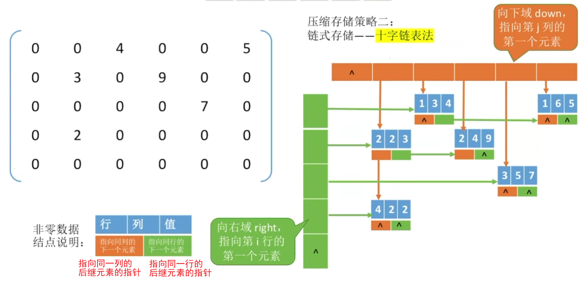
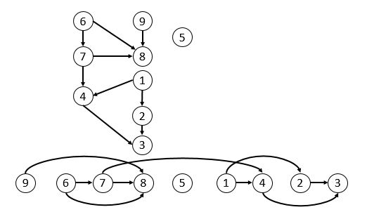
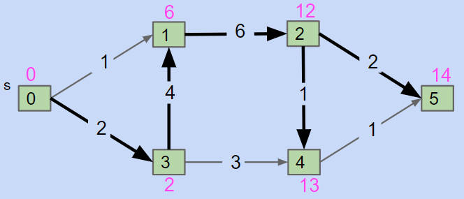

# 绪论

抽象数据类型（Abstract Data Type, ADT），是一种拥有类似行为的模型（需要被implement的interface）：比如线性表（List）、串（String）、栈（Stack）、队列（Queue）、树（Tree）、图（Graph）、集合（Set）、字典（Map）、并查集（Disjoint Set）、优先队列（Priority Queue）等。

各种抽象数据类型是interface，数据结构是implement（实现）。解决问题的第一步是确定抽象数据类型，然后才是选择哪种implement是最优的；

抽象数据类型也可能要分层选择实现的方法：优先队列的最优选择是堆，又因为堆是完全二叉树，而这种树的最优实现是数组下标法；Hash表可以选择Separate Chaining，而一个坑位的存储方法也有多种选择。

数据结构和算法，是具体的实现（implement）

- 线性表、串、栈、队列
  - 可动态扩容、循环的数组（Array）
  - 可动态扩容、循环的链表（Link List）
- 树
  - 下标是parentID的数组，尤其适用于完全二叉树
  - 互相链接的节点：孩子链表法、孩子兄弟表示法
- 图
- 集合、字典：查找键是否存在，集合返回是/否，字典返回值/null
  - 线性表存储的
  - 二叉搜索树、平衡二叉树
  - B树、B+树
  - 红黑树、左倾红黑树
  - Hash表
    - Closed Addressing Separate Chaining：一个坑位里可以用线性表，也可以用二叉树、B树、红黑树、堆等等。
    - Open Addressing Probing：那就继续玩你的数组吧。
- 并查集：二者是否所属于同一集合
  - 记录一堆集合？
  - 数组里记录所属group的ID？
  - 树是最好的选择
- 优先队列：add和pop随机发生，每次pop出的是最值
  - 每次add后都运行排序算法？太傻了吧。
  - 线性表、二叉搜索树、红黑树、Hash表？它们能通过每次搜索出最值来实现功能，但也不是最优的方法。
  - 堆（Heap）：一种特殊的二叉树

---

从这里开始到第2小节都是毫无营养的教科书定义，建议别看

数据元素：结构体，包含许多数据项

数据结构：结构体之间的关系

同样的数据元素之间可以组成不同的数据结构（可以数组可以图）

不同的数据元素，可组成相同的数据结构（进程和人都有队列）

## 数据结构三要素

四种**逻辑结构**（数据结构的定义）：

- 集合：互斥（元组）
- 线性结构：一对一
- 树形结构：一对多
- 图状结构：多对多

对每一种逻辑结构，还要研究对于数据结构的**运算**方法（CRUD）。

> 思考：通过这四种基本的逻辑结构的组合，能构造出高级语言中的任何数据类型？

四种**物理结构**（数据结构的实现）：

- 顺序存储
- 链式存储
- 索引存储：B+树？
- 散列存储：Hash表？

## 数据类型


高级语言的数据类型：值和操作的总称

- 原子类型：int、float、bool、char
- 结构类型：list、stack、queue、tuple、set、dict

## 算法

数据结构的运算（CRUD）

- 有穷性：有限时间能完成
- 确定性：相同的输入产生相同的输出
- 可行性
- 输入：可以没有输入
- 输出：不能没有输出

> 有人说“程序=数据结构+算法”

好的算法：

- 正确性
- 可读性：写点注释
- 健壮性：Robust，异常处理
- 省时：时间复杂度低
- 省内存：空间复杂度低

### 时间复杂度

评估时间开销不能靠实验事后统计，因为与机器性能、编译语言、指令集有关（除非能精准地控制变量），所以最好能够预估。

设问题规模为$n$，执行完算法的时间为$T(n)$

我们只考虑当n无穷大时，算法时间复杂度的同阶的大小（无穷大的比较，详见《高等数学》）

比如$T(n)=O(3n^3+5n+2)=O(n^3)$

那么可以分析代码，只用考虑循环与函数调用/递归。如果时间与数据的分布有关，一般考虑最坏时间复杂度，和平均时间复杂度（期望）。

无穷大比阶：
$$
O(1)<O(\log_2n)<O(n)<O(n\log_2n)<O(n^a)<O(a^n)<O(n!)<O(n^n)
$$

### 空间复杂度

设问题规模为$n$，需要内存空间为$S(n)$

与时间复杂度一样，考虑无穷大的情况

代码区的为固定，空间复杂度为常数，因此可以忽略，只需要考虑数据区。

那么可以分析代码，只用考虑高维数组与函数调用/递归。

> 原地工作：指算法所需内存空间为常量

## 代码规定

修改内部数据需要传址，本课规定用C++的引用

```c++
void func(int &a); //引用普通变量
void func(int a[]); //引用数组
void func(SqList &L); //引用结构体
```

分配内存用`p = (ElemType *) malloc(sizeof(ElemType) * size)`

回收内存用`free(p)`

# 线性表

## 定义

n个数据元素的有次序、有限序列。
$$
L=(a_1,\ a_2,\ \dots,\ a_i,\ a_{i+1},\ \dots,\ a_n)
$$

- 位序：i，从1开始
- 表长：n，n=0时为空表
- 表头元素
- 表尾元素
- 直接前驱
- 直接后继

## 运算

```c++
void InitList(&L); //创建，设定初值
void DestroyList(&L); //销毁

bool ListInsert(&L, i, e); //插入（增）
bool ListDelete(&L, i, &e); //删除第i个元素，返回到e中

ElemType GetElem(L, i); //按位查找，返回元素
int LocateElem(L, e); //按值查找，返回下表

//其它
int Length(L);
bool Empty(L);
```

## 实现

|          | 顺序表                                                       | 链表                                       |
| -------- | ------------------------------------------------------------ | ------------------------------------------ |
| 逻辑结构 | 线性结构                                                     | 线性结构                                   |
| 物理结构 | 顺序存储                                                     | 链式存储                                   |
| 创建     | 连续的大空间分配，不方便扩容<br />存储密度高，但容易浪费空间 | 离散的小空间分配，方便扩容<br />存储密度低 |
| 销毁     | 一次性删光                                                   | 依次删除节点                               |
| 按位查找 | O(1)，可随机存取                                             | O(n)，不可随机存取                         |
| 按值查找 | O(n)，但对于排序后的可用折半查找加速                         | O(n)                                       |
| 增加节点 | O(n)，移动所有后继元素，时间更长                             | O(n)，查找前驱节点，时间更短               |

### 顺序表

1. 静态分配：大小无法更改（不用手动free，c语言自动会回收）

```c++
#define MaxSize 10
typedef struct{
	ElemType data[MaxSize];
    int length; //当前的长度
}SqList;

void InitList(SqList &L){
	L.length = 0;
}
```

2. 动态分配：可扩容，每次扩容`size*=2`（malloc新地址，再遍历复制到新地址，再free原地址）。可设定填充率ratio=0.25，当填充率小于0.25时，缩容`size/=4`。

```c++
#define MaxSize 10
typedef struct{
	ElemType *data; //首址
	int MaxSize; //malloc分配的长度
	int length; //当前的长度
}SqList;

void InitList(SqList &L){
	L.data = (ElemType *) malloc(MaxSize * size(SqList));
	L.length = 0;
	L.MaxSize = MaxSize;
}
```

- 随机访问：`L.data + size(ElemType) * i`，在O(1)的时间找到第i个元素
- 存储密度高
- 扩容不方便
- 插入删除不方便

---

插入：判断合法，往后移动

```c++
bool ListInsert(SqList &L, int i, ElemType e) {
    //判断插入的位置是否合法，
    if (i < 1 || i > L.length + 1)
        return false;
    //判断表是否存满了
    if (L.length >= MaxSize)
        return false;

    //后面的元素后移
    for (int j = L.length; j >= i; j--) {
        L.data[j] = L.data[j - 1];
    }
    L.data[i - 1] = e;
    L.length++;
    return true;
}
```

> 最好时间复杂度：插入到表尾，i=1，循环0次，O(1)
>
> 最坏时间复杂度：插入到表头，i=n+1，循环n次，O(n)
>
> 平均时间复杂度：O(n)
> $$
> \frac{0+1+2+\dots+n}{n+1}=\frac{n}{2}
> $$

---

删除：判断合法，给e赋值，往前移动

```c++
bool ListDelete(SqList &L, int i, ElemType &e) {
    //判断i的位置是否合法
    if (i < 0 || i > L.length) {
        return false;
    }
    //取出将要被删除的数
    e = L.data[i - 1];
    //将其后的数据前移
    for (int j = i; j <= L.length; j++) {
        L.data[j - 1] = L.data[j];
    }
    //线性表长度减一
    L.length--;
    return true;
}
```

> 最好时间复杂度：删除表尾，i=n，循环0次，O(1)
>
> 最坏时间复杂度：删除表头，i=1，循环n-1次，O(n)
>
> 平均时间复杂度：O(n)
> $$
> \frac{0+1+2+\dots+(n-1)}{n}=\frac{n-1}{2}
> $$

---

按位查找：判断合法，返回元素

```c++
ElemType GetElem(SqList L, int i) {
    //判断是否越界
    if (i < 0 || i > L.length)
        return -1;
    return L.data[i - 1];
}
```

> 时间复杂度：O(1)

---

按值查找：返回第一个与e值相等的下标

```c++
int LocateElem(SqList L, ElemType e) {
    //循环出查找
    for (int i = 0; i < L.length; i++) {
        if (L.data[i] == e) //c语言不能直接对结构体判等，自己用&&依次判断
            return i + 1; //返回位序
    }
    return -1;
}
```

> 最好时间复杂度：在表头，i=1，循环1次，O(1)
>
> 最坏时间复杂度：在表尾，i=n+1，循环n次，O(n)
>
> 平均时间复杂度：O(n)
> $$
> \frac{1+2+\dots+n}{n}=\frac{n+1}{2}
> $$

### 单向链表

```c++
typedef struct LNode {
    ElemType data;
    LNode *next;
} LNode, *LinkList;
//LinkList就是LNode*（LNode类型的指针），只不过为了在命名上区分表（头）和普遍的节点
```

- 不带头节点：表头直接指向后续节点

```c++
bool InitList(LinkList &L) {
    L = NULL; //空表暂时没有任何数据
    return true;
}

bool Empty(LinkList L) {
    return L == NULL;
}
```

- 带头结点：表头之后跟了一个数据为空的头节点，头节点再指向后续节点。更方便编程

```c++
bool InitList(LinkList &L) {
    L = (LNode *) malloc(sizeof(LNode)); //分配一个头节点
    if (L == NULL)
        return false; //头节点分配失败，可能是内存不足
    L->next = NULL; //头节点之后暂时没有节点，头节点也不存放数据
    return true;
}

bool Empty(LinkList L) {
    return L->next == NULL;
}
```


---

插入：找到前驱节点，插到后面

```c++
bool ListInsert(LinkList &L, int i, ElemType e) {
    if (i < 1) return false; //判断位序i是否合法
    
    //不带头节点，且插入位置正好为表头时，得单独处理
    // if (i = 1) {
    //     LNode *s = (LNode *) malloc(sizeof(LNode));
    //     s->data = e;
    //     s->next = L;
    //     L = s;
    //     return true;
    // }
    
    LNode *p; //指针指向当前扫面到的节点
    int j = 0; //记录p指向的节点的位序
    p = L; //L指向头节点，从头开始
    while (p != NULL && j < i - 1) {
        //循环扫描
        p = p->next;
        j++;
    }
    if (p == NULL) //i值超过表长，不合法
        return false;
    
    LNode *s = (LNode *) malloc(sizeof(LNode));
    s->data = e;
    s->next = p->next;
    p->next = s;
    return true;
}
```

> 最好时间复杂度：插入到表头尾，i=1，循环0次，O(1)
>
> 最坏时间复杂度：插入到表尾，i=n+1，循环n次，O(n)
>
> 平均时间复杂度：O(n)
> $$
> \frac{0+1+2+\dots+n}{n+1}=\frac{n}{2}
> $$

已知节点P，在P后插新节点。

已知节点P，在P前插新节点，要么从表头开始往后找到P的前驱节点再作后插，要么新建一个P的后继节点Q，把P的内容复制到Q，再把新内容复制到P。

---

删除：找到前驱节点，删除后面

```c++
bool ListDelete(LinkList &L, int i, ElemType &e) {
    if (i < 1) return false;
    
    //不带头节点，且删除位置正好为表头时，得单独处理
    // if (i = 1) {
    //     LNode *q = L;
    //     e = q->data;
    //     L = q->next;
    //     free(q);
    //     return true;
    // }
    
    LNode *p;
    int j = 0;
    p = L;
    while (p != NULL && j < i - 1) {
        p = p->next;
        j++;
    }
    LNode *q = p->next;
    e = q->data;
    p->next = q->next;
    free(q);
    return true;
}
```

> 最好时间复杂度：删除表头，i=1，循环0次，O(1)
>
> 最坏时间复杂度：删除表尾，i=n，循环n-1次，O(n)
>
> 平均时间复杂度：O(n)
> $$
> \frac{0+1+2+\dots+(n-1)}{n}=\frac{n-1}{2}
> $$

---

按位查找

按值查找

---

尾插法新建链表：一个个元素插入到链表末尾

头插法新建链表：一个个元素插入到链表头部。可以让链表原地逆置（空间复杂度O(1)）

```c++
//头插法新建链表
LNode *p, *temp;
LinkList L = (LinkList) malloc(sizeof(LNode));
L->next = NULL;
while(1){
	scanf("%d", &x);
	temp = (LNode *) malloc(sizeof(LNode));
	temp->data = x;
	temp->next = L->next;
	L->next = temp;
}

//原地逆置
p = L->next; //p为从前往后顺序遍历的指针，用于作为头，以头插法插入
L->next = NULL; //链表清空，准备重新头插法新建链表
while(p!=NULL){
    temp = p->next; //temp存下一个顺序的元素
    p->next = L->next; //头插法插入
    L->next = p; //替换头部
    p = temp; //恢复p作为顺序遍历的头的席位
}
```

### 双向链表

```c++
typedef struct DNode {
    ElemType data; //数据域
    struct DNode *prior, *next; //前指针和后指针
} DNode, *DLinkList;

bool InitDLinkList(DLinkList &L) {
    L = (DNode *) malloc(sizeof(DNode)); //分配一个头节点
    if (L == NULL)
        return false;
    L->prior == NULL; //头节点前后指针都指向空
    L->next == NULL;
    return true;
}

bool Empty(DLinkList L) {
    return (L->next == NULL);
}
```

### 循环链表

循环单向链表：表尾的next指向头节点

```c++
typedef struct LNode{
    ElemType data;
    struct LNode *next;
}LNode,*LinkList;

bool InitRLinkList(LinkList &L){
    L=(LNode *)malloc(sizeof(LNode)); //分配一个头节点
    if (L=NULL)
        return false; //内存不足，分配失败；
    L->next=L; //头节点nex指向头节点，以此形成循环链表
    return true;
}

bool Empty(LinkList L) {
    return (L->next == L);
}
```

循环双向链表：表尾的next指向头节点，表头的prior指向尾节点

```c++
typedef struct DNode{
    ElemType data;
    struct DNode *prior,*next;
}DNode,*DLinkList;

bool InitRDLinkList(DLinkList &L){
    L=(DNode *)malloc(sizeof(DNode)); //分配头节点
    if (L==NULL) return false;
    L->prior=L;
    L->next=L; //循环抱住自己
    return true;
}

bool Empty(LinkList L) {
    return (L->next == L);
}
```

### 静态链表

静态分配一块连续的空间，存储下标作为next，表尾指向NULL的记为-1的下标。

删除的时候不用移动元素，只用修改前驱的next下标。插入的时候得找空闲位。

适用于不支持指针的低级语言，比如操作系统中的FAT表

# 栈

## 定义

只能在一端进行插入、删除的线性表（后进先出，LIFO）

- 栈顶
- 栈底
- 空栈

## 性质

### 卡特兰数

入栈n个元素，出栈序列的种类：$\frac{C_{2n}^{n}}{n+1}$

## 运算

```c++
void InitList(&S); //创建，设定初值
void DestroyList(&S); //销毁

bool Push(&S, e); //进栈
bool Pop(&S, &e); //出栈，弹出栈顶

bool GetTop(S, &e); //返回栈顶

//其它
int Length(S);
bool Empty(S);
```

## 实现

### 顺序栈

用下标表示栈顶元素的位置

```c++
# define MaxSize 10
typedef struct {
    ElemType data[MaxSize];
    int top; //记录栈顶的下标
} SqStack;

void InitStack(SqStack &S) {
    S.top = -1;
}
```

---

入栈

```c++
bool Push(SqStack &S, ElemType e) {
    if (S.top == MaxSize - 1) return false; //栈满
    S.data[++S.top] = e;
	//等价下面两个语句
	//S.top+=1; //先将栈顶指针指向下一个位置
	//S.data[S.top]=t; //再填充元素
    return true;
}
```

出栈

```c++
bool Pop(SqStack &S, ElemType &e) {
    if (S.top == -1) return false; //栈空
    e = S.data[S.top--];
	//等价于下面
	//x=S.data[S.top]; //先取元素
	//S.top -=1; //再改指针
    return true;
}
```

### 链式栈

就是头插法的单向链表

## 应用

### 括号匹配

依次扫描所有字符，遇到左括号入栈，遇到右括号则出栈检查是否匹配，以及最后栈中是否有剩余。

```c++
bool bracketCheck(char *str, int length) {
    SqStack S;
    InitStack(S);
    for (int i = 0; i <length ; i++) {
        if (str[i]=='(' || str[i]=='[' || str[i]=='{'){
            Push(S,str[i]);
        } else{
            if (StackEmpty(S))
                //扫描到右括号且当前栈空，匹配失败
                return false;
            char topElem;
            Pop(S,topElem);
            if (str[i]==')' && topElem!='(')
                return false;
            if (str[i]==']' && topElem!='[')
                return false;
            if (str[i]=='}' && topElem!='{')
                return false;
        }
    }
    return StackEmpty(S);//最后检查栈，若空匹配成功，非空匹配失败
}
```

### 表达式求值

计算机计算表达式，需要把带有界限符（就是括号）、不同优先级的表达式转换为只有操作数和运算符的带有操作顺序的表达式，并按照顺序一个一个算。

逆波兰式：

将`a/b`写成`ab/`的后缀表达式

从左往右读：

- 遇到操作数，直接加入后缀表达式
- 遇到(，直接入栈
- 遇到)，依次弹出栈内的运算符到(为止
- 遇到运算符，依次弹出栈中优先级更高或相等的，直到(或空栈，之后再把当前运算符入栈

`A+B*(C-D)-E/F` -> `ABCD-*+EF/-`

接着将后缀表达式从左往右入栈，若遇到运算符则弹出两个元素，先出栈的为右操作数，计算的结果再重新入栈。

波兰式：

将`a/b`写成`/ab`的前缀表达式

所有的左右操作、左右括号与逆波兰式相反

### 函数调用栈

见《计组》

## 变种

共享栈：顺序栈，两头都作为栈底，同时向中间存满

# 队列

## 定义

只能在一端进行插入，在另一端删除的线性表（队尾入，对头出。先进先出，FIFO）

- 队头
- 队尾
- 空队列

## 运算

```c++
void InitQueue(&Q); //创建，设定初值
void DestroyQueue(&Q); //销毁

bool EnQueue(&Q, e); //入队
bool DeQueue(&Q, &e); //出队

bool GetHead(L, &e); //返回队头

//其它
int Length(Q);
bool Empty(Q);
```

## 实现

### 顺序队列

用下标表示栈队头和队尾元素后一个的位置

```c++
# define MaxSize 10
typedef struct {
    ElemType data[MaxSize];
    int front, rear; //队头指针和队尾指针
} SqQueue;

void InitQueue(SqQueue &Q) {
    Q.rear = Q.front = 0;//初始化时，队头队尾都指向0
}

bool Empty(SqQueue Q){
    return (Q.rear==Q.front);
}
```

---

入队：用取余把线性空间变成环状的，而得空掉一位（或者记录size，`size==MaxSize`时为满；或者记录最后一次操作的tag，若`rear==front`且tag为入队，才为满）

```c++
bool EnQueue(SqQueue &Q, ElemType e) {
    if ((Q.rear + 1) % MaxSize == Q.front) return false;//队满，注意这里的判满条件
    //这里的判满条件会造成浪费一个存储空间的问题
    Q.data[Q.rear] = e;
    Q.rear = (Q.rear + 1) % MaxSize;//通过取余操作让整个队列循环起来
    return true;
}
```

出队

```c++
bool DeQueue(SqQueue &Q, ElemType &e) {
    if (Q.rear == Q.front) return false; //队空
    e = Q.data[Q.front];
    Q.front = (Q.front + 1) % MaxSize;
    return true;
}
```

### 链式队列

单向链表的尾部作为队头，头部作为队尾

因此不光需要记录头部的地址，还要记录尾部的地址

```c++
typedef struct LinkNode {
    ElemType data;
    LinkNode *next;
} LinkNode;

typedef struct {
    LinkNode *front, *rear;
} LinkQueue;

void InitQueue(LinkQueue &Q) {
    Q.front = Q.rear = (LinkNode *) malloc(sizeof(LinkNode));
    //初始化时，front 、rear 都指向头节点
    Q.front->next = NULL;
}

bool Empty(LinkQueue Q) {
    return Q.front == Q.rear;
}
```

## 应用

- 树的层次遍历
- 图的广度优先遍历
- 《操作系统》的就绪队列、假脱机技术……

## 变种

双端队列：两边都能进出

输入受限的双端队列：只有一边能进，两边都能出

输出受限的双端队列：只有一边能出，两边都能进

# 数组

## 定义

多维数组压扁为线性表

## 运算

二维数组行优先：
$LOC(a_{i,j})=LOC(a_{0,0}+(i*行宽+j)*sizeof(a))$

## 应用

矩阵的压缩存储

1. 对称矩阵

只存对角线上的和一个三角区的

算出$a_{i,j}$到下标k的转换函数即可


2. 三角矩阵

和对称矩阵类似，最后附上一位存常数


3. 稀疏矩阵

非零元素远远少于矩阵元素个数

- 只存非零元素的值和坐标的三元组数组就行了（不能快速访问）

- 十字链表

  

# 串

## 定义

字符串：零个或多个字符组成的有限序列（元素为字符、操作对象通常为子串的线性表）
$$
S =  a_1 a_2 \dots a_n ,\ n\ge0
$$

- 空串：""
- 子串：任意个连续字符组成的子序列（也可能为空串）
- 主串
- 字符在主串中的位置：从1开始数
- 子串在主串中的位置==子串中第一个字符在主串中的位置

## 运算

```c++
void InitStr(SString &S); //初始化
bool StrAssign(SString &T, char *str); //赋值
void StrCopy(SString &T, SString S); //复制

bool StrEmpty(SString S); //判空
int StrLength(SString S); //获取字符串长度

void ClearString(SString &S); //清空
void DestoryString(SString &S); //销毁

void Concat(SString &T, SString S1, SString S2); //串接
bool SubString(SString &Sub, SString S, int pos, int len); //求子串，返回到Sub中

//定位（若主串S中存在与串T值相同的子串，则返回它在主串S中第一次出现的位置，否则函数值为0）
int Index(SString S, SString T);

//比较（若S>T,则返回值>0；若S=T,则返回值=0；若S<T，则返回值<0）
int StrCompare(SString S, SString T);
```

## 实现

### 顺序存储

静态分配：

```c++
#define MAXLEN 255 //预定义最大串长为255

typedef struct {
    char ch[MAXLEN];//每个分量存储一个字符
    int length; //串的实际长度
} SString;
```

动态分配：

```c++
#define MAXLEN 255 //预定义最大串长为255

typedef struct {
    char *ch;//按串长分配存储区，ch指向串的基地址
    int length; //串的实际长度
} HString;
```

---

下面的代码都设定字符串的第一个字符存在第1个下标处（第0位不用）

子串

```c++
bool SubString(SString &Sub, SString S, int pos, int len)
{
    if (pos + len - 1 > S.length)
        return false;
    for (int i = pos; i < pos + len; ++i)
        Sub.ch[i - pos + 1] = S.ch[i];
    Sub.length = len;
    return true;
}
```

比较

```c++
//比较（若S>T,则返回值>0；若S=T,则返回值=0；若S<T，则返回值<0）
int StrCompare(SString S, SString T)
{
    for (int i = 1; i <= S.length & i <= T.length; i++)
    {
        if (S.ch[i] != T.ch[i])
            return S.ch[i] - T.ch[i];
    }
    // 扫描过的所有字符都相同，则长度长的串更大，相同则返回0
    return S.length - T.length;
}
```

定位（朴素模式匹配算法）：用上面两个函数，在主串S中依次用`SubString`取子串，与模式串（查找的目标串T）用`StrCompare`对比，若结果为0则找到子串，返回子串在主串中的位置

最坏时间复杂度：设主串n个字符，子串m个字符，共对比了$n-m+1$个子串，考虑到$n \gg m$，于是共$O(m*(n-m+1)) = O(nm-m^2+m)=O(nm)$

```c++
//定位（若主串S中存在与串T值相同的子串，则返回它在主串S中第一次出现的位置，否则函数值为0）
int Index(SString S, SString T)
{
    int i = 1, n = StrLength(S), m = StrLength(T);
    SString sub;
    while (i <= n - m + 1)
    {
        SubString(sub, S, i, m);
        if (StrCompare(sub, T) != 0)
            ++i;
        else
            return i; // 返回子串在主串中的位置
    }
    return 0; // S中不存在与T相等的子串
}

//直接通过数组下标重写这种算法：
int Index(SString S, SString T)
{
    int i = 1; // i记录当前主串指针
    int j = 1; // j记录模式串指针
    while (i <= S.length && j <= T.length)
    {
        if (S.ch[i] == T.ch[j])
        {
            ++i;
            ++j; // 继续比较后续字符
        }
        else
        {
            i = i - j + 2; // 检查下一个字串
            j = 1;         // 重制j的值
        }
    }
    if (j > T.length)
    { // 匹配成功
        return i - T.length;
    }
    else
    {
        return 0;
    }
}
```

KMP：可以看出朴素模式匹配算法中，忽略了模式串蕴含的信息，主串的指针可以不用回溯。在往后匹配的时候，如果子串内部就存在重复的部分，那么就可以跳过这一部分。

例如`ababa`在最后一位（i=j=5）失配了，那么接下来可以保留i=5，再直接设置j=3，开始接下来的判断。

保持i不往回走，只让j往后走，算法如下：


关键在于要根据子串求出j在每个地方失配后转移到的位置，也就是next数组

有两种固定的变法：

- next[1]必定为0：如果在i=j=1处就失配了，那么i要加一，j不动，为了减少程序分支，让j=0，i/j到下一个循环里都+=1
- next[2]必定为1：如果i=j=2处失配，那么j变成1

其它剩下的用“子串往后推，直到第一次前缀和后缀重合，或者超出失配处的分界线”的方法，手动推算`ababaa`

| j       | 1    | 2    | 3    | 4    | 5    | 6    |
| ------- | ---- | ---- | ---- | ---- | ---- | ---- |
| 模式串  | a    | b    | a    | b    | a    | a    |
| next[j] | 0    | 1    | 1    | 2    | 3    | 4    |

其实这里还有不完美的：j=3时，主串的这里肯定不是a，而next[j]让第一位也就是a凑过来，肯定是对不上的，然后又会得到next[1]=0

所以可以在生成next的时候也考虑到这一点，如果next[j]指向处的字符与j处相同，那么就改用next[next[j]]，如果考虑到多层嵌套，那么就从左到右，把新数组记为nextval，依次生成：

```c++
nextval[1] = 0;
for (int j = 2; j <= T.length; ++j) {
    if (T.ch[next[j]] == T.ch[j])
        nextval[j] = nextval[next[j]];
    else
        nextval[j] = next[j];
}
```

上例变为

| j          | 1    | 2    | 3    | 4    | 5    | 6    |
| ---------- | ---- | ---- | ---- | ---- | ---- | ---- |
| 模式串     | a    | b    | a    | b    | a    | a    |
| next[j]    | 0    | 1    | 1    | 2    | 3    | 4    |
| nextval[j] | 0    | 1    | 0    | 1    | 0    | 4    |

### 链式存储

```c++
typedef struct{
    //每个结点存1个字符,存储密度低，每个字符1B，每个指针4B
    char ch;
    StringNode *next;
} StringNode,*String;

typedef struct{
	//每个结点存多个个字符,存储密度提高，每个字符1B，每个指针4B
    char ch[4];
    StringNode *next;
} StringNode,*String;
```

# 树、森林

## 定义

$n \ge 0$个节点集合

- $n==0$，空树
- $n \ge 1$，仅有一个根节点，且有0个或多个互不相交的子树

---

- 叶子节点：没有后继（度=0）

- 分支节点：有后继（度>0）

- 根节点无前驱，其它节点有且仅有一个前驱

  ---

- 层：从根往叶子

- 高度：从叶子往根

- 深度：总共多少层

- 路径：从根到叶子的路

- 路径长度：经过的边数

  ---

- 节点的度：节点有几个分支

- 树的度：各节点度的最大值

  > n叉树：任意节点的度<=n。（可以为空树）
  >
  > 度为n的树：任意节点的度<=n，且至少有一个节点的度是n。（至少有n+1个节点）

- 祖先节点（所有的前驱）

- 父节点（双亲结点）（直属的前驱）

- 兄弟节点（同一层的）

- 孩子节点（直属的后继）

- 子孙节点（所有的后继）

---

- 无序树
- 有序树：子树之间有顺序之分

森林：多棵树

## 性质

1. $节点数=节点度的和+1（根节点）$

2. 度为n的树/n叉树，在第h层最多有$n^{h-1}$个节点

3. 度为n的树/n叉树，高度为h，总共最多节点数：
   $n^0+n^1+n^2+\dots+n^{h-1}=\frac{n^h-1}{n-1}$

4. 具有m个节点的n叉树，最小高度为？

   $\frac{n^{h-1}-1}{n-1}<m<\frac{n^h-1}{n-1}，求h$

## 运算

很多基本的运算不要求写代码，所以这里就不提了，这里只关注遍历算法

次序遍历

- 先序遍历：根、子树的先序遍历

  > 树/森林的先序遍历序列 == 孩子兄弟表示法的二叉树的先序遍历

  > [!TIP]
  >
  > 打印文件夹树状结构（深层的缩进），就是在先序遍历

- 中序/后序遍历：子树的后序遍历、根

  > 树/森林的后序遍历序列 == 孩子兄弟表示法的二叉树的**中序遍历（注意这里不一样）**
  
  > [!TIP]
  >
  > 统计文件夹的大小，就是在后序遍历

层次遍历：一层一层，从左到右访问（广度优先遍历）

## 实现

### 顺序存储

双亲表示法：类似静态链表，存储父节点在数组中的下标

```c++
#define MAX_TREE_SIZE 100

typedef struct {
    ElemType data;
    int parent; //双亲位置域
} PTNode;
typedef struct {
    PTNode nodes[MAX_TREE_SIZE]; //双亲表示
    int n; //结点数
} PTree;
```

找孩子不方便

### 链式存储

孩子表示法：存储孩子的链表

```c++
#define MAX_TREE_SIZE 100
struct CTNode{
    int child; //孩子节点在数组中的位置
    CTNode *next; //下一个孩子
};
typedef struct {
    ElemType data;
    CTNode *childList; //第一个孩子
} CTBox;
typedef struct {
    CTBox nodes[MAX_TREE_SIZE]; //双亲表示
    int n;//结点数
} CTree;
```

找父节点不方便

---

孩子兄弟表示法：左边指向第一个最左边的孩子节点，右边指向右边的一个兄弟节点

```c++
typedef struct CSNode{
    ElemType data;
	//第一个孩子和右兄弟指针
    CSNode *firstChild, *nextsibiling;
} CSNode,*CSTree;
```


## 应用

### 并查集

集合，由N个散点，用`connect(i,j)`合并成若干个集合，用`isConnect(i,j)`查询是否在同一个集合内。

用树的思想，在同一集合内的节点的祖爷爷相同。`connect`就是把一方的祖爷爷作为另一方的祖爷爷的爹。

为了提高效率，需要让树变矮：

- 小树并入大树：`connect`中，在祖爷爷中记录数中元素的个数，合并时让“大树的祖爷爷”作为“小树的祖爷爷”的爹（也可以记录高度，不过高度都是不超过$log_2N$）
- 路径压缩：查询祖爷爷的操作中，查到祖爷爷后，让路径点都直接作为祖爷爷的孩子，可以大幅减小树的高度

### k叉哈夫曼树

由来见[二叉哈夫曼树](#哈夫曼树)

k>2时，n的个数可能填不满，于是就得补充值为0的虚段，再进行哈夫曼编码的造树算法


如何计算需要补充虚段的个数？
$$
对于一棵严格k叉树：\\
n=总节点数\\
n_k=度为k的节点数\\
n_0=叶子节点数\\
\begin{cases}
n=k*n_k+1 \\n=n_k+n_0
\end{cases}
\Rightarrow n_k=\frac{n_0-1}{k-1}
$$
所以补充虚段个数要使$\frac{n_0-1}{k-1}$为整数

比如8叉，初始只有19个数，就需要补充3个虚段

> 也可以简单想象：取出16个数构成2个满叉，那么还需要6个~~kig~~填充物才能和这2个叉组成一个新的满叉，剩下有19-16=3个初始填充物，所以还需要6-3=3个虚段。
>
> 上面图中的3叉，初始有8个，也一样可以想象：取出6个数构成2个满叉，补上1个数和两个满叉构成一个新的满叉，还剩1个初始数，在加上一个补充的虚段，就能构成又一个新的满叉。
>
> 这种想象并不能正确地进行哈夫曼编码，但可以计算虚段的个数（纯属懒得背公式）。

# 二叉树

## 定义

任意节点的度小于等于2的树

- 满二叉树：所有层填满的二叉树
- 完全二叉树：满二叉树或最底层右边有空缺


## 性质

从1开始编号：

- $i$节点的左孩子为$2i$，右孩子为$2i+1$，父节点为$\lfloor i/2 \rfloor$
- $i \le \lfloor n/2 \rfloor$为分支节点，$i \gt \lfloor n/2 \rfloor$为叶子节点

---

1. $叶子节点个数=双分支节点个数+1$

2. 第h层最多$2^{h-1}$个节点

3. 高度为h，总共最多节点数：$2^h-1$

4. 具有n个节点的完全二叉树，最小高度为
   $$
   2^{h-1} \le n \le 2^h-1，求h\\
   \log_2(n+1) \le h \le \log_2n+1\\
   h=\lceil \log_2(n+1)\rceil或\lfloor \log_2n+1 \rfloor\\
   （向上取整、向下取整）
   $$
   
5. 完全二叉树，最多只会有1个度为1的节点

## 运算

很多基本的运算不要求写代码，所以这里就不提了，这里只关注遍历算法

次序遍历

- 先序遍历：先根遍历：根左右
- 中序遍历：中根遍历：左根右
- 后序遍历：后根遍历：左右根

都是到一个节点，往左，再往右：

1. 刚到的时候，第一次到的时候访问——先序遍历
2. 从左分支回来，第二次到的时候访问——中序遍历
3. 从右分支回来，第三次到的时候访问——后序遍历


次序遍历：用递归（也可以用栈转换为循环）

```c++
//先序遍历
void PreOrder(BiTree T) {
    if (T != NULL) {
        visit(T);//访问根节点
        PreOrder(T->lchild);//遍历左子树
        PreOrder(T->rchild);//遍历右子树
    }
}

//中序遍历
void InOrder(BiTree T) {
    if (T != NULL) {
        InOrder(T->lchild);
        visit(T);
        InOrder(T->rchild);
    }
}

//后序遍历
void PostOrder(BiTree T) {
    if (T != NULL) {
        PostOrder(T->lchild);
        PostOrder(T->rchild);
        visit(T);
    }
}
```

---

层次遍历：一层一层，从左到右访问（广度优先遍历）

用一个辅助队列，一个节点出队的时候，左右孩子节点入队

```c++
void levelOrder(BiTree T) {
    LinkQueue Q; //辅助队列
    InitQueue(Q);
    BiTree p;
    EnQueue(Q, T);
    while (!isEmpty(Q)) {
        DeQueue(Q, p); //队头结点出队
        visit(p);
        if (p->lchild != NULL)
            EnQueue(Q, p->lchild);
        if (p->rchild != NULL)
            EnQueue(Q, p->rchild);
    }
}
```

---

利用中序遍历+另一种遍历构造二叉树，会手算就行

## 实现

### 顺序存储

从第1位开始按满二叉树的编号存，这样就能用编号计算出孩子节点和父节点，从而实现遍历。

如果存非满二叉树，还按照编号存，就会浪费很多空间。

### 二叉链表

指向左右孩子指针，n个节点，有2n个指针，实际用到的只有n-1个指针，n+1个指针是浪费的（空链域）

```c++
typedef struct BiTNode {
    ElemType data; //数据域
    BiTNode *lchild, *rchild; //左右孩子指针
} BiTNode, *BiTree;

//插入新结点
bool InsertNode(BiTree T, ElemType val) {
    BiTNode *p = (BiTNode *) malloc(sizeof(BiTNode));
    p->data = val;
    p->lchild = NULL;
    p->rchild = NULL;
    T->lchild = p;//作为左孩子
}
```

### 三叉链表

再多一个指向父节点的指针，方便往上层回溯

```c++
typedef struct BiTNode {
    ElemType data; //数据域
    BiTNode *lchild, *rchild; //左右孩子指针
    BiTNode *parent; //指向父节点的指针
} BiTNode, *BiTree;
```

### 线索二叉树

把叶子节点没用到的左/右孩子指针，指向前序/中序/后续遍历次序的前驱/后继节点。

从而在存储结构中就可以得出部分节点遍历的前后关系，而不需要再用遍历算法从头开始计算。

为了区分指针指向的是孩子节点还是前驱/后继，还要加上两个tag


按照遍历顺序依次访问，用pre和q指向遍历过程中的前一个和当前的节点，用来指定前驱、后继

```c++
typedef struct ThreadNode {
    ElemType data; //数据域
    ThreadNode *lchild, *rchild; //左右孩子指针
    int ltag, rtag; //左右线索标志
} ThreadNode, *ThreadTree;

//用pre和q指向遍历过程中的前一个和当前的节点，用来指定前驱、后继
void visit(ThreadNode *q) {
    if (q->lchild == NULL) {
        //左子树为空，建立前驱线索
        q->lchild = pre;
        q->ltag = 1;
    }
    if (pre != NULL && pre->rchild == NULL) {
        //建立前驱结点的后继线索
        pre->rchild = q;
        pre->rtag = 1;
    }
    pre = q;
}

//中序遍历二叉树，一边遍历一边线索化
void InThread(ThreadTree T) {
    if (T != NULL) {
        InThread(T->lchild);
        visit(T);
        InThread(T->rchild);
    }
}

//创建中序线索化二叉树T
void CreatInThread(ThreadTree T) {
    pre = NULL;
    if (T != NULL) { //非空二叉树才能线索化
        InThread(T); //中序线索二叉树
        if (pre->rchild == NULL) {
			//处理遍历的最后一个结点
            pre->rtag = 1;
        }
    }
}
```

之后就可以按照顺序直接遍历了（对于双分支需要按照遍历方法推倒出前驱和后继在哪）

```c++
//中序线索二叉树找中序后继
//找到以P为根的子树中，第一个被中序遍历的结点
ThreadNode *FirstNode(ThreadNode *p){
    //循环找到最左下结点（不一定是叶结点）
    while(p->ltag==0){
        p=p->lchild;
    }
    return p;
}

//在中序线索二叉树中找到结点p的后继结点
ThreadNode *NextNode(ThreadNode *p){
    //在右子树中最左下结点
    if(p->rtag==0)return FirstNode(p->rchild);
    else return p->rchild;
}

//对中序线索二叉树进行中序遍历（利用线索实现的非递归算法），空间复杂度为O(1)；
void InOrder(ThreadNode *T){
    for (ThreadNode *p = FirstNode(T);  p!=NULL ; p=NextNode(p)) {
        visit(p);
    }
}
```

|        | 中序线索二叉树 | 先序线索二叉树                              | 后序线索二叉树                              |
| ------ | -------------- | ------------------------------------------- | ------------------------------------------- |
| 找前驱 | ✅              | ❌<br />（除非从头开始遍历，或记录有parent） | ✅                                           |
| 找后继 | ✅              | ✅                                           | ❌<br />（除非从头开始遍历，或记录有parent） |

## 应用

### 哈夫曼树

最优树，带权路径长度（WPL，Weighted Path Length）最短的树，可用于压缩编码

一段文本有10个A，8个B，80个C，2个D。如何编码才能最短存储？


看整个树的WPL（所有叶子的带权路径长度之和），图中右边的编码方式是最优的。

如何设计出最优的编码方式（哈夫曼树）呢？应该让权值更大（频率更大）的放在更浅的层，即获得更短的编码。

有n个带有权值的叶子节点（数根），附加上n-1个节点，最后变成2n-1个节点

1. 挑选权值最小的两个数根，组合成一棵树，权值相加成为新数根的权值
2. 重复1中的操作（共重复n-1次），直到只剩下1个数根

> 因为选择最小权值没有固定选法，所以哈夫曼树并不唯一，但WPL都是相同且最小的
>
> 这种可变长的编码也是“前缀编码”，即没有一个编码是其它编码的前缀，在连续排列多个编码时不会产生解析的歧义

# 图

## 定义

$G=(V,E)$

V顶点，E边

无向图，$E=\{(a,b),(c,d)\}$

有向图，$E=\{<a,b>,<c,d>\}$

网：边带权的图


## 运算

很多基本的运算不要求写代码，所以这里就不提了，这里只关注遍历算法

- 深度优先遍历 DFS，类似树的先序遍历
- 广度优先遍历 BFS，类似树的层次遍历

两个在遍历算法中会用到的接口：

```c++
int FirstNeighbor(G, x); //求G中与顶点x相连的第一个顶点，若有则返回顶点号，否则返回-1
int NextNeighbor(G, x, y); //在与x相连的顶点链表中，返回相对于y之后的一个顶点，没有则返回-1
```

深度优先遍历：递归深入，以及由于图的连通性，需要一个visited数组记录已访问过的顶点

```c++
bool visited[MAX_VERTEX_NUM]; //访问标记数组

void DFSTraverse(Graph G){ //对图G进行深度优先遍历
	for(i=0;i<G.vexnum;i++){
		visited[i]=FALSE;
	}
	for(i=0;i<G.vexnum;i++){  //从0号顶点开始遍历
		if(!visited[i]){// 对每个连接分量调用一次DFS
			DFS(G,i); //vi未访问过，从vi开始DFS
		}
	}
}

//深度优先遍历
void DFS(Graph G,int v){ //从顶点v出发，深度优先遍历图G
	visit(v); //访问初始顶点v
	visited[v]=TRUE; //对v做已访问标记
	for(w=FirstNeighbor(G,v);w>=0;w=NextNeighbor(G,v,w)){
		if(!visited[w]){  //w为v的尚未访问的邻接顶点
			DFS(G,w);
		}
	}
}
```

---

广度优先遍历：同样需要一个辅助队列，以及由于图的连通性，需要一个visited数组记录已访问过的顶点

```c++
bool visited[MAX_VERTEX_NUM]; //访问标记数组

void BFSTraverse(Graph G){ //对图G进行广度优先遍历
	for(i=0;i<G.vexnum;i++){
		visited[i]=FALSE;
	}
	InitQueue(Q);  //初始化辅助队列Q
	for(i=0;i<G.vexnum;i++){  //从0号顶点开始遍历
		if(!visited[i]){// 对每个连接分量调用一次BFS
			BFS(G,i); //vi未访问过，从vi开始BFS
		}
	}
}

//广度优先遍历
void BFS(Graph G,int v){ //从顶点v出发，广度优先遍历图G
	visit(v); //访问初始顶点v
	visited[v]=TRUE; //对v做已访问标记
	Enqueue(Q,v); //顶点v入队列Q
	while(!isEmpty(Q)){
		DeQueue(Q,v); //顶点v出队列
		//检测v所有邻接点
		for(w=FirstNeighbor(G,v);w>=0;w=NextNeighbor(G,v,w)){
			if(!visited[w]){  //w为v的尚未访问的邻接顶点
				visit(w);  //访问顶点w
				visited[w]=TRUE;  //对w做已访问标记
				EnQueue(Q,w);  //顶点w入队列
			}
		}
	}
}
```

|                    | DFS                                   | BFS                       |
| ------------------ | ------------------------------------- | ------------------------- |
| 最坏空间复杂度     | $O(\abs{V})$，递归调用栈和visited数组 | $O(\abs{V})$，visited数组 |
| 邻接矩阵时间复杂度 | $O(\abs{V}^2)$                        | $O(\abs{V}^2)$            |
| 邻接表时间复杂度   | $O(\abs{V}+\abs{E})$                  | $O(\abs{V}+\abs{E})$      |

## 实现


### 邻接矩阵法

顺序存储

```c++
#define MaxVnum 100;
typedef char VexType;
typedef int EdgeType;
typedef struct
{
    VexType Vex[MaxVnum];
    EdgeType Edge[MaxVnum][MaxVnum];
    int vexnum,edgenum;
} MGragh;
```

一维数组存放顶点的信息，二维数组存放边的信息（邻接矩阵）

- 用0/1表示图中是否有边
- 用无穷和数值表示网中是否有边
- 有向图/网的矩阵的行是出度，列是入度

空间复杂度$O(\abs{V}^2)$，只适合稠密图，否则应该用对称矩阵的压缩方法压缩

记邻接矩阵为A，则矩阵乘法后$A^n$中$A^n[i][j]$的物理意义是“从顶点i出进入顶点j的路径长度为n的路径个数”

### 邻接表法

顺序存储+链式存储


顶点的顺序表，每个顶点指向边的链表，边中存储了另一端的顶点编号（链表中的存储顺序不唯一）

无向图的存储中有浪费，重复存了$\abs{E}$个边

计算有向图的入度不方便

### 十字链表法

存储有向图，对邻接表法的优化


### 邻接多重表

存储无向图，对邻接表法的优化


## 应用

### 最短路径

从一个顶点出发到其它点的最短距离

对于无权图，可以直接用BFS的生成树，高度即是最短距离

---

对于带权图

- Dijkstra算法：可以得到从一点到其他所有点的最短路径

  从出发点开始，将通往周边顶点且路程最短的顶点纳入疆域，循环往复（为了记录路径，需要一个path数组保存前驱节点，和一个记录路径长度的数组dist）

  从V0出发可以到V1和V4，按照距离最短于是先到V4，设定path中V4的前驱为V0，再更新到V1、V2、V3的最短距离为8、14、7。于是再选则去V3，之后设定前驱、依次更新最短距离、再选择去其它没去过的点。

  

  > 时间复杂度$O(\abs{V}^2)$
  >
  > 不适用于带负权值的图

- Floyd算法：可以得到各个顶点间的最短路径

  对于一开始的邻接矩阵，也就是不允许中转的路径信息。之后依次考虑加上某个中转节点，看能否使邻接矩阵中的某些值（路径长度）变短，另外用一个path矩阵记录前驱。

  

  > 时间复杂度$O(\abs{V}^3)$
  >
  > 适用于带负权值的图

---


### 最小生成树

在带权连通图中生成总长度最小的树

- Prim算法：随机选一个顶点作为开始，每次连通通往周边节点的边中长度最小的一条边，把新节点加入疆域，循环往复

  > 时间复杂度$O(\abs{V}^2)$
  >
  > 适合边稠密图

> [!NOTE]
>
> Dijkstra和Prim的细微差别（[一个直观建树动画](https://youtu.be/ZCMTccvfaTQ?list=PL8FaHk7qbOD7SvlWei_-neNmgmXzJG2ad&t=214)）
>
> 最小生成树是整个图的属性，最短路径是取决于出发点的。
>
> 不是所有出发点的最短路径都是最小生成树，如下图只有从B点的出发，最短路径才能和最小生成树相同。
>
> 
>
> 也不是所有的图都有“最短路径就是最小生成树”的顶点，如下图，从任意一边的顶点出发，在中间去对岸时，最短路径都是分别从2走，这就不是最小生成树了。
>
> 

- Kruskal算法：将所有边按照长度从小到大排序，每次连通所有边中最小长度的边（且不构成循环图），直到共连接了$V-1$条边。

  > 时间复杂度$O(\abs{E}*\log_{2}\abs{E})$
  >
  > 适合边稀疏图

### 有向无环图 描述表达式


### 有向无环图 拓扑排序

AOV网（Activity On Vertex Network）

有向无环的工程图，活动在顶点上，有向边表示依赖关系（不能互相依赖，也就是不能有环）



拓扑排序：找出正向执行工程的一种可行顺序

1. 选择没有前驱（入度为0）的顶点执行，并删除与它为起点的边
2. 重复1直到全部执行完

逆拓扑排序：反向的顺序

1. 选择没有后继（出度为0）的顶点执行，并删除与它为终点的边
2. 重复1直到全部执行完

> DFS遍历的顺序就等于逆拓扑排序，但是不能对有环的情况报错失败

### 有向无环图 关键路径

AOE网（Activity On Edge Network）

有向无环的工程图，活动在边上，顶点是事件（状态）。



关键路径：路径长度最长的路径（工程耗时最长）

关键活动耗时增加，工期一定增长；关键活动耗时减少，工期不一定减短（可能不止一条关键路径）

# 集合、字典

集合、字典：查找键是否存在，集合返回是/否，字典返回值/null

关键字：用于查找中对比的值，是唯一的。

查找表：由同一类型数据元素构成的集合（可由各种数据结构构成）

- 静态查找表：查
- 动态查找表：查、增、删

> 记录中除了关键字，还有数据或者指向数据的指针。

评价指标：

- 平均查找长度 ASL (Average Search Length)：平均查找次数，画判定树（补充失败节点），查找成功/查找失败两种情况

  > 是对比的次数，所以哈希中映射到空，则直接算0次
  >
  > 不是时间复杂度（计算代码的执行次数）
  >
  > 是“查找”这个操作的次数的加权平均

## 排序过的线性表

### 顺序查找

对线性表中的元素从头到尾查

查找的时间复杂度 = $O(n)$

### 折半查找

有序的顺序表（链表不能随机访问）

$mid = \lfloor (low+high)/2 \rfloor$

```c++
int Binary_Search(SSTable L, ElemType key)
{
    //初始状态升序排列
    int low = 0;
    int high = L.TableLen - 1;
    int mid;
    while (low <= high)
    {
        mid = (low + high) / 2;
        if (L.elem[mid] == key)
            return mid;
        else if (L.elem[mid] > key)
            high = mid - 1;
        else
            low = mid + 1;
    }
    //到这里high<key<low
    return -1;
}
```

查找的时间复杂度 = $O(log_2n)$

### 分块查找


查找的时间复杂度 = 两部分组成

## 二叉排序树（BST）

Binary Search Tree

$左子树节点值<根节点值<右子树节点值$

也就是$左子树所有节点值<根节点值<右子树所有节点值$，二叉排序树的中序遍历是一个递增的有序序列

查找：往左往右查呗

查找的时间复杂度：取决于树的高度，最好$O(log_2n)$，最坏$O(n)$

---

插入：先查找到插入的位置，再插入

```c++
typedef struct BSTNode
{
    ElemType key;
    struct BSTNode *lchild, *rchild;
} BSTNode, *BSTree;

//循环方式
BSTNode * BST_Search(BSTree T, ElemType key)
{
    while (T != NULL && T->key != key)
    {
        if (T->key > key)
            T = T->lchild;
        else
            T = T->rchild;
    }
    return T;
}

//递归方式
BSTNode * BST_Search(BSTree T, ElemType key)
{
    if (T == NULL)
        return NULL;
    if (T->key == key)
        return T;
    if (T->key > key)
        return BST_Search(T->lchild, key);
    else
        return BST_Search(T->rchild, key);
}

//插入
bool BST_Insert(BSTree &T, ElemType k)
{
    if (T == NULL)
    {
        T = (BSTNode *)malloc(sizeof(BSTNode));
        T->key = k;
        T->lchild = NULL;
        T->rchild = NULL;
        return true;
    }
    else if (T->key == k)
        return false;
    else if (T->key > k)
        BST_Insert(T->lchild, k);
    else
        return BST_Insert(T->rchild, k);
}
```

删除一个节点（会手算即可）：

- 若是叶子节点，直接删除
- 若度为1，则用子树顶替
- 若度为2，则用中序遍历的直接前驱（左子树中最大的）/直接后继（右子树中最小的）代替

> [!NOTE]
>
> 一维空间：二叉树的每个节点分割为左右域，从而一整棵二叉树把一维空间分割为许多段。
>
> 二维空间：四叉树（Quadtree），每个节点把平面分割为四个象限
>
> 三维空间：八叉树（Octree），每个节点把空间分给为八个象限
>
> k维空间：Kd-tree，树中深度为$i$个节点划分第$i \% k$个维度（第0层的1个节点划分第0个维度，第1层的2个节点划分第1个维度，第2层的4个节点划分第2个维度……）

## 平衡二叉树（AVL）

AVL树（人名的简写）

<u>任何节点</u>的左右子树的高度差不大于1的二叉排序树

---

查找：与二叉排序树一样

查找的时间复杂度：$O(log_2n)$

---

平衡因子：每个节点处$左子树高度-右子树高度$

插入删除后找到最小的不平衡子树（平衡因子的绝对值>1），进行修正，使之平衡且依旧满足$左子树节点值<根节点值<右子树节点值$

插入：发现有最小不平衡子树时，子节点晋升。


高度为h的平衡二叉树的最少节点数为$n_h$：
$$
n_0=0,\ n_1=1,\ n_2=2,\ n_3=4,\ n_4=7\\
n_h=n_{h-2}+n_{h-1}+1
$$

---

删除：

1. 按照二叉排序树的删除方法删除节点
2. 向上寻找最小不平衡子树
3. 调整平衡
4. 重复2，直到根节点（因为层数减少可能导致上层不平衡）

## B树

实时完全平衡的树

m阶：表示单个节点的最大分叉数（3阶B树俗称2-3树，4阶B树俗称2-3-4树）

- 根节点至少1个关键字，也就是至少2棵子树

为了保证查找的效率，规定：

- 其他节点至少$\lceil m/2 \rceil-1$个关键字，也就是至少$\lceil m/2 \rceil$个子树（关键字的间隙是下层的开区间）
- 所有节点完全平衡：所有子树高度相同
- 关键字升序排列


插入：先查找到终端节点再插入，若填满了则从中间裂开，中间的那个当爹

删除：若低于下限了，向左右邻居兄弟借、拉着爹下来，或左右邻居兄弟合并，自己看着办

## B+树

B树中节点的信息是保存在节点中的，而考虑到外存块的限制，就只在终端节点记录指向节点信息的指针（见《操作系统》的“多级索引顺序文件”）


## 红黑树

平衡二叉树在插入删除后要计算大量的平衡因子

红黑树只用调整子父爷三辈就行了，非常方便，但情况非常复杂

```c++
struct RBNode
{
    int color; // 结点颜色（0:黑色, 1:红色）
    int key;
    RBNode *parent; // 父结点指针，用于定位
    RBNode *lchild, *rchild; // 左右孩子指针
};
```

要求：

- 左根右：$左子树节点值<根节点值<右子树节点值$
- 根叶黑：根节点一定是黑色，叶子节点（这里指NULL指针）一定是黑色
- 不红红：不存在同时为红色的父子节点
- 黑路同：对于每个节点，往下到任意NULL节点，走过的黑色节点数相同（不含该节点），称为“黑高”


特性：

- 从根节点到NULL节点的 最长路径（间隔着红） 不大于 2倍的最短路径（全黑）
- 若根节点的黑高为h，则内部节点数（NULL指针算外部节点）至少$2^h-1$，也就是没有红色节点的情况
- 若总高度h，则$根节点黑高 \ge \lfloor h/2 \rfloor$，则内部节点数$n \ge 2^{h/2}-1$，则$h \le 2log_2(n+1)$

---

查找：与二叉排序树一样

查找的时间复杂度：$O(log_2N)$

---

插入和删除，散了吧……


## 左倾红黑树

Left-Leaning Red-Black Tree

B树的代码实现麻烦，AVL的旋转需要大量计算。左倾红黑树用旋转的方法，构造出与3阶B树（一个节点内最多2个关键字）等价的二叉树，Base Case、代码实现比传统红黑树简单很多。


因为和3阶B树等价，树高最多为2倍的B树，所以时间复杂度也是$O(log_2N)$，但效率比传统红黑树稍稍差一点。

[CS61B Josh Hug的讲解](https://www.youtube.com/playlist?list=PL8FaHk7qbOD6aKgTz2W-foDiTeBEaBoS3)

## 哈希表（Hash Table）

试图建立从关键字到存储地址的映射，如果不同的关键字映射到同一个位置了，则称发生了<u>冲突</u>（冲突不可能避免），这些关键字被称为<u>同义词</u>。

哈希函数（散列函数，H(key)）：目的是把连续分布的打散、随机化

1. 直接定址法：减掉基址，类似数组下标的计算
2. 数字分析法：可能记录中有重复的部分，那么只取重复度低的部分
3. 除留余数法：通常选不大于m的最大质数作为除数（即使这样会空出几位不用，但总体上更不容易冲突）
4. 平方取中法

---

解决冲突的方法：

1. 链地址法（Closed Addressing, Separate Chaining）：同义词存在Bucket中，坑位就指向这个Bucket，Bucket可以是线性表、二叉树、B树、红黑树、堆等任意集合（不可以套娃Hash表吧，不然又得考虑冲突的问题）。

2. 开放定址法（Open Addressing）：若冲突，则探测Probing新地址（可以占了别人的茅坑）

   $H_i=(H(key)+d_i) \% m$

   查找的时候，若对比发现不一致，就得按照$H_i$序列一直找下去，直到一个空位

   删除的时候，还不能置空，因为会导致查找后续的失效，只能再加一个删除标记……

   1. 线性探测法：依次往后找空位

      $d_i=0,1,2,3,4,\dots,m-1$

   2. 平方探测法：

      $d_i=0,1^2,-1^2,\dots,k^2,-k^2\ (k\le m/2)$

   3. 伪随机法：伪随机序列

3. 再哈希法：准备多个哈希函数，一个冲突了就用下一个

---

装填因子$\alpha=\frac{记录的个数n}{哈希表的长度m}\\$​，越大则越容易冲突，这时候就需要动态扩容（需要重新计算所有原有样本的H(key)，再填入新的更大的Hash Table）

## 前缀树

Trie字典树、Radix基数树（压缩的Trie）

可用于字符串的autocomplete

# 排序

对序列进行排序，不同记录的关键字可相等

稳定性：关键字相等的记录，在排序后依旧保持排序前的次序

- 内部排序：在内存内操作的排序

  - 插入排序
    - **直接插入排序**：一个一个记录往后看，如果比前面的一个小，就后移序列腾出空位，把它插入到前面排好的序列中
    - **希尔排序**：分批次地插入
  - 交换排序
    - **冒泡排序**：一个一个记录从后往前冒泡交换，每一趟冒一个最小的记录到前面，好多趟
    - **快速排序**：开头的枢轴元素被两边的挤到中间，递归

  - 选择排序
    - **简单选择排序**：每次从前往后，选择最小的，交换到前面排好的队尾（队尾就是i++）
    - **堆排序**：大根堆：视为完全二叉树（顺序存储，可以用下标计算方便得访问孩子节点），从中间往前面检查，根节点小的话就一直下沉，孩子节点上升上升下沉，使最终$根>左右孩子$。再从大顶（A[0]）摘取最大的，并和排在最后的交换位置，再上升下沉保持$根>左右孩子$，依次摘取，得到递增序列
  - **归并排序**：考察两个相邻的有序子序列，依次把最小的放到一个辅助数组中，Merge成一个新的有序序列，相当于倒立的二叉树，递归实现从小到大的合并。
  - **基数排序**：挂葡萄，摘葡萄，n个记录，每个记录有d个关键字，每个关键字有r种值

- 外部排序：需要与磁盘进行读写操作的排序

| 内部排序算法 | 时间复杂度                            | 空间复杂度                  | 稳定性 | 抽象                  |
| ------------ | ------------------------------------- | --------------------------- | ------ | --------------------- |
| 直接插入排序 | $O(n^2)$                              | $O(1)$                      | ✅      | 前到后，插入          |
| 希尔排序     | 约$O(1.3)$                            | $O(1)$                      | ❌      | for(d=n/2;d>=1;d=d/2) |
| 冒泡排序     | $O(n^2)$                              | $O(1)$                      | ✅      | 后到前，冒泡          |
| 快速排序     | $O(nlog_2n)$                          | $O(log_2n)$<br />（递归栈） | ❌      | 递归，二叉分割        |
| 简单选择排序 | $O(n^2)$                              | $O(1)$                      | ❌      | 前到后，交换          |
| 堆排序       | $O(nlog_2n)$                          | $O(1)$                      | ❌      | 顶放到最后，二叉下沉  |
| 归并排序     | $O(nlog_2n)$                          | $O(n)$<br />（辅助数组）    | ✅      | 递归，二叉合并        |
| 基数排序     | d*(n+r)<br />（不是比较的时间复杂度） | r<br />（队列的指针）       | ✅      | 挂葡萄，摘葡萄        |

## 直接插入排序

一个一个记录往后看，如果比前面的一个小，就后移序列腾出空位，把它插入到前面排好的序列中

```c++
//顺序表存储
void InsertSort(int A[], int n)
{
    int i, j, temp;
    // 从i=1开始，将数组读各元素插入已经排好序的序列中
    for (int i = 1; i < n; i++)
    {
        // A[i]关键字小于前驱
        if (A[i] < A[i - 1])
        {
            // temp暂存A[i]
            temp = A[i];
            // 检查i前面已经排好序的元素
            for (j = i - 1; j >= 0 && A[j] > temp; j--)
                // 所有大于temp的元素都向后挪位
                A[j + 1] = A[j];
            // 将temp复制到插入位置
            A[j + 1] = temp;
        }
    }
}

// 优化，使用哨兵+折半查找
void BetterInsertSort(int A[], int n)
{
    int i, j, low, high, mid;
    // 依次将A[2]-A[n]插入前面已经排好序的序列
    for (i = 2; i <= n; i++)
    {
        // 将A[i]暂存到A[0]中
        A[0] = A[i];
        // 设置折半范围
        low = 1;
        high = i - 1;
        // 进行折半查找
        while (low <= high)
        {
            mid = (low + high) / 2;
            if (A[mid] > A[0])
                high = mid - 1;
            else
               	//即使等于也继续查找右半表，因为要稳定性
                low = mid + 1;
        }
        // 统一后移元素，空出插入位置
        for (j = i - 1; i >= low; j++)
            A[j + 1] = A[j];
        A[low] = A[0];
    }
}
```

> 稳定的
>
> 顺序表、链表均可
>
> 空间复杂度：$O(1)$
>
> 最好时间复杂度：$O(n)$
>
> 最坏时间复杂度：$O(n^2)$
>
> 平均时间复杂度：$O(n^2)$

## 希尔排序

分批次地插入

```c++
// for d in (n/2, ..., 1):
//     for i in (0, ... d-1):
//         A[i,i+d,i+2d,...]作插入排序

void ShellSort(int a[], int n)
{
    int i, j, d, tmp;
    for (d = n / 2; d >= 1; d = d/2)
    {
        for (i = 0; i < d; i++)
        {
            for (j = i + d; j < n; j += d)
            {
                if (a[j] < a[j - d])
                {
                    tmp = a[j];
                    for (k = j - d; k >= 0 && a[k] > tmp; k = k - d)
                    {
                        a[k + d] = a[k];
                    }
                    a[k + d] = tmp;
                }
            }
        }
    }
}

// 另一种写法，轮流切换当前的子表，每次只前插一个，另外这里A[0]作为哨兵暂存
void ShellSort(int A[], int n)
{
    int d, i, j;
    // 将A[0]作为暂存单元，j<=0时，插入位置已到
    for (d = n / 2; d >= 1; d = d / 2) // 步长变化
    {
        for (i = d + 1; i <= n; i++) // 轮流切换子表
        {
            if (A[i] < A[i - d]) // 需要将A[i]插入有序增量子表
            {
                A[0] = A[i]; // 暂存在A[0]
                for (j = i - d; j > 0 && A[j] > A[0]; j = j - d)
                {
                    A[j + d] = A[j]; // 记录后移，寻找插入位置
                }
                A[j + d] = A[0]; // 插入
            }
        }
    }
}
```

> 不稳定
>
> 只能顺序表
>
> 空间复杂度：$O(1)$
>
> 最坏时间复杂度：$O(n^2)$
>
> 但优于插入排序

## 冒泡排序

一个一个记录从后往前冒泡交换，每一趟冒一个最小的记录到前面，好多趟

```c++
// 交换
void swap(int &a, int &b)
{
    int temp = a;
    a = b;
    b = temp;
}
// 冒泡排序
void BubbleSort(int A[], int n)
{
    int i;
    int j;
    // 冒泡排序，每次都把最小的数移到最前面
    for (i = 0; i < n - 1; i++)
    {
        bool flag = false; // 标记此次排序是否发生交换
        for (j = n - 1; j > i; j--)
        {
            if (A[j - 1] > A[j])
            {
                swap(A[j - 1], A[j]);
                flag = true;
            }
        }
        if (flag == false)
            return; // 本次排序没有发生交换，说明表已经有序
    }
}
```

> 稳定的
>
> 顺序表、链表均可
>
> 空间复杂度：$O(1)$
>
> 最好时间复杂度：$O(n)$
>
> 最坏时间复杂度：$O(n^2)$
>
> 平均时间复杂度：$O(n^2)$

## 快速排序

选定一个枢轴元素，把小于它的放到左边，大于它的放到右边

比如选开头的元素作为枢轴元素，就留出了一个空隙，头尾两个指针向中间靠拢，过程中像堆麻将一样把不属于自己这一侧的扔到对面的空隙中

每次把枢轴元素安置到位后，递归对它的左右序列继续处理（每一趟排序后枢轴元素都到了排序正确的位置，且之后将不再移动）（若枢轴元素刚好是在最左边或最右边，则接下来只在一边产生新的枢轴元素）

```c++
int Partition(int A[], int low, int high)
{
    int pivot = A[low]; // 选择初始枢轴元素
    while (low < high)
    {
        while (low < high && A[high] >= pivot)
            high--;
        A[low] = A[high];
        while (low < high && A[low] <= pivot)
            low++;
        A[high] = A[low];
    }
    //此处low==high，就是枢轴元素应该存放的位置
    A[low] = pivot;
    return low;
}

void QuickSort(int A[], int low, int high)
{
    int pivot_index;
    if (low < high)
    {
        pivot_index = Partition(A, low, high);
        QuickSort(A, low, pivot_index - 1);
        QuickSort(A, pivot_index + 1, high);
    }
}
```

> 不稳定的
>
> 顺序表、链表均可
>
> 时间复杂度、空间复杂度跟递归深度有关
>
> 
>
> - 最好的情况是每次分裂左右后枢轴元素都跑到中间，完全平衡的二叉树，递归深度$log_2n$
> - 最坏的情况是每次分裂左右后枢轴元素都在最边上（比如原本就是有序/逆序的），为一棵只往一边长的树，递归深度$n$
>
> 最坏空间复杂度：$O(n)$
>
> 最好空间复杂度：$O(log_2n)$
>
> 最好时间复杂度：$O(nlog_2n)$
>
> 最坏时间复杂度：$O(n^2)$
>
> 平均时间复杂度：$O(nlog_2n)$

## 简单选择排序

每次从前往后，选择最小的，交换到前面排好的队尾（队尾就是i++）

```c++
// 简单选择排序
void SelectSort(int A[], int n)
{
    for (int i = 0; i < n - 1; i++)
    {                // 一共进行n-1次
        int min = i; // 记录最小元素的位置
        for (int j = i + 1; j < n; j++)
        { // 在i+1-n中选择最小的元素
            if (A[j] < A[min])
                min = j; // 更新最小元素位置
        }
        if (min != i)
            swap(A[i], A[min]); // 交换
    }
}
```

> 不稳定
>
> 顺序表、链表均可
>
> 空间复杂度：$O(1)$
>
> 时间复杂度：$O(n^2)$

## 堆排序

大根堆：

1. 建堆：将序列视为完全二叉树（顺序存储，可以用下标计算方便得访问孩子节点），从中间（最后一个分叉节点）往前面检查，根节点小的话就一直下沉，孩子节点上升，使最终$根>左右孩子$（不要求左右孩子之间谁大谁小谁在左谁在右）。
2. 排序：再从大顶（A[0]）摘取最大的，并和排在最后的交换位置，再上升下沉保持$根>左右孩子$，依次摘取，得到递增序列

```c++
void HeadAdjust(int A[], int k, int length)
{
    // 第一位为空，利于算二叉树的左右孩子，也用来暂存要下沉的数
    A[0] = A[k];
    for (int i = 2 * k; i <= length; i *= 2) // i *= 2是向下检查是否需要一直下沉
    {
        // 一开始选的是左孩子，如果右孩子更大，选右孩子
        if (i + 1 <= length && A[i + 1] > A[i])
            i = i + 1; // 选右孩子
        // 孩子比根节点大的话，换位
        if (A[i] > A[0])
        {
            A[k] = A[i]; // 让孩子上来
            k = i;       // 让根节点下去
        }
        else // 否则退出
            break;
    }
    A[k] = A[0];
}

void HeapSort(int A[], int length)
{
    // 建立大根堆，按照二叉树的编号
    // 从最后一个分叉节点开始，到顶部
    for (int i = length / 2; i >= 1; i--)
        // 根节点小的话就下沉，孩子节点上升
        HeadAdjust(A, i, length);

    // 取下大顶A[1]，让编号最后的元素上去
    // 再下沉，换上另一个最大的
    // 循环往复
    for (int i = length; i > 1; i--)
    {
        swap(A[i], A[1]); // 取下大顶A[1]，让编号最后的元素上去
        HeadAdjust(A, 1, i - 1); // 下沉，换上另一个最大的
    }
}
```

在已经成型的大根堆中

- 插入元素：插入在末尾，然后看是否能一直上升
- 删除元素：用末尾的元素替补删除的位置，然后看是否能一直下沉

> 不稳定
>
> 顺序表
>
> 空间复杂度：$O(1)$
>
> 平均时间复杂度：$O(nlog_2n)$，建堆大约$O(n)$，之后的交换与下沉共$n-1$次，每次下沉不超过$log_2n$层，所以不超过$(n-1)log_2n$

## 归并排序

Merge

这里是2路归并，当然也可以多路归并

考察两个相邻的有序子序列，依次把最小的放到一个辅助数组中，Merge成一个新的有序序列，相当于倒立的二叉树，递归实现从小到大的合并。


```c++
int *B = (int *)malloc(n * sizeof(int)); // 辅助数组B

// A[low///mid]和A[mid+1,high]各自有序，将两个部分归并
void Merge(int A[], int low, int mid, int high)
{
    int i, j, k;
    for (k = low; k <= high; k++)
        B[k] = A[k]; // 将A中所有元素复制到B中

    // 归并
    for (i = low, k = low, j = mid + 1; i <= mid && j <= high; k++)
    {
        // 将较小的元素赋值到A中
        if (B[i] <= B[j])
            A[k] = B[i++];
        else
            A[k] = B[j++];
    }

    // 将剩余的元素也赋值到A中
    while (i <= mid)
        A[k++] = B[i++];
    while (j <= high)
        A[k++] = B[j++];
}

void MergeSort(int A[], int low, int high)
{
    if (low < high)
    {
        // 从中间划分
        int mid = (low + high) / 2;
        // 对左半部分归并排序
        MergeSort(A, low, mid);
        // 对右半部分归并排序
        MergeSort(A, mid + 1, high);
        // 归并
        Merge(A, low, mid, high);
    }
}
```

> 稳定的
>
> 顺序表
>
> 空间复杂度：$O(n)$，一个辅助数组B，还有$\lceil log_2n \rceil$个递归栈，但因为是$n$的低阶无穷大就只有$O(n)$了
>
> 时间复杂度：$O(nlog_2n)$，相当于倒立的二叉树，一共归并$\lceil log_2n \rceil$层（趟），每层（趟）要对比$n-1$次

## 多路归并排序

n个记录，进行k路归并排序（下图不是严格的4路归并）


时间复杂度：$O(nlog_kn)$，相当于倒立的k叉树，一共归并$\lceil log_kn \rceil$层（趟），每层（趟）要对比$(n-1)*(k-1)$次

k越大，需要归并的趟数就越小，但$\frac{k-1}{log_2k}$是递增的，所以<u>k并不是越大越好</u>。

在增大k的时候，由于有k路，所以一次归并操作的时候就需要进行k-1次关键字对比，可以用败者树减少比较的次数：

下图归并段3的"1"胜出后，"6"替补进来，只用让"6"和下标为4的"17"对比，再让"6"和下标为2的"12"对比，再让"6"和下标为5的"2"对比，得出"2"为第二轮的胜者。

这样几乎能把时间复杂度降到：$(n-1)*log_kn*log_2k=O(nlog_2n)$，和2路归并差不多


## 基数排序

挂葡萄，摘葡萄

不用比较，而是通过某种运算让它们对号入座

n个记录，每个记录有d个关键字，每个关键字有r种值
$$
L=[(k^{d-1}_0k^{d-2}_0\dots k^0_0),\ \dots,\ (k^{d-1}_nk^{d-2}_n\dots k^0_n)]
\\
其中0 \le k \le r-1
$$
需要记录$r$个队列的指针，进行$d$趟分配+收集


> 稳定的
>
> 链表
>
> 空间复杂度：$O(r)$
>
> 时间复杂度：$O(d*(n+r))$，$d$趟分配（$n$个记录到各个队列中）+收集（串联$r$个队列指针）
>
> 因此当n特别大、r和d不太大的时候，基数排序就比$O(nlog_2n)$的排序算法更优

## 外部排序

需要与磁盘进行读写操作的排序

由于每次只能操作部分块的数据，所以用可以用[归并排序](#归并排序)

1. 因为归并排序需要有序的序列，所以先对每个块进行初始的内部排序

   

2. 对多个归并段进行归并，一个归并段对应一个输入缓冲区，每次读入各个归并段的头部，一旦输入缓冲区空了就要从该归并段补充。

   

多次2之后归并为一个段，就完成了对大文件的归并


$$
外部排序时间开销=O(第1步中读写外存+第1步中内存里的内部排序+第2步中读写外存+第2步中内存里的归并排序)\\
= O(第1步中读写外存 + 第2步中读写外存) \dots外存开销占大头\\
= O(文件块数 + 文件块数*归并趟数)\\
= O(n + n * \lceil log_kr \rceil)
$$
所以只能通过减少归并趟数，来优化时间。

文件块数为$n$，归并排序的趟数=$\lceil log_kr \rceil$，$k$是k路归并（上图为2路，2合1），$r$是初始归并段的个数。

增加输入缓冲区的个数，能多路归并（k变大），也能让初始归并段变长（初始归并段个数减少，n变小），真是一举两得啊！

1. 增大k会导致，一次归并操作中关键字对比的次数增加，应对方法败者树见[多路归并排序](#多路归并排序)，于是时间复杂度就成了$O(n + nlog_2n)$

2. 其实可以让初始归并段更长：置换-选择排序

   输入的缓冲区只作为临时的比较池，只把最小的大于最小值的那个输出，并记录新的最小值

   

   但这又会造成各个段的长度不一，而只有特定的归并次序才能使读写次数最少：最佳归并树，同[k叉哈夫曼树](#k叉哈夫曼树)一样

   

   所以到这里时间复杂度就成了$O(文件块数 + 最佳归并树的WPL*2)$

