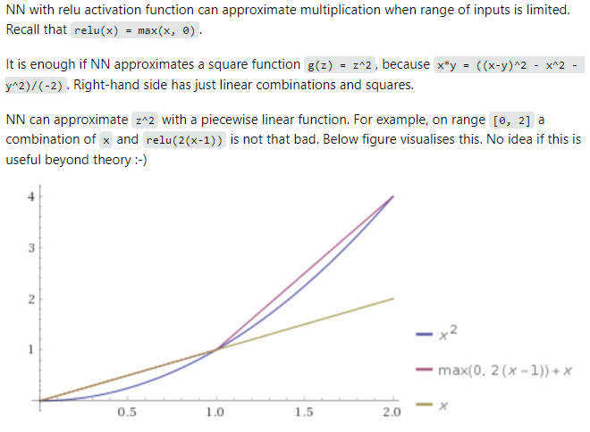
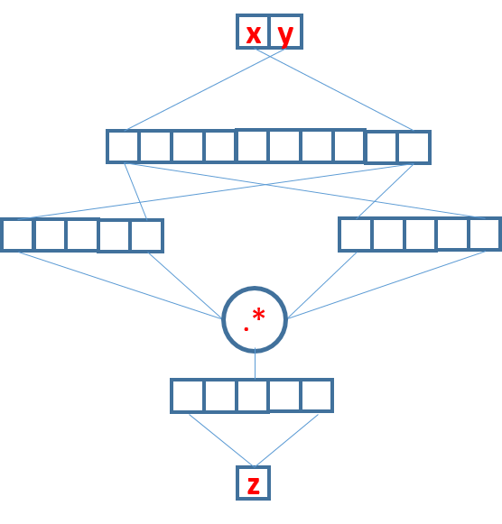

## 神经网络拟合乘法

神经网络无法精确且泛化地学会乘法

`s(W*x+b)`结构的神经网络能在有限范围内拟合$x^2$，所以对于$x_1*x_2=\frac{(x_1+x_2)^2-x_1^2-x_2^2}{2}$，在一定范围内也可以拟合

[regression - Can a deep neural network approximate multiplication function? - Cross Validated](https://stats.stackexchange.com/questions/217703/can-a-deep-neural-network-approximate-multiplication-function)

添加点积结构能改善❓待实验

[标准神经网络“乘加”结构的普适性讨论 - 知乎](https://zhuanlan.zhihu.com/p/56972144)

---

> https://stackoverflow.com/a/20950522
>
> Regular feedforward neural networks are **not turing complete**. They are, in effect, equivalent to a single complicated mathematical function that may do quite a lot of calculations but doesn't have any ability perform looping or other control flow operations.
>
> However, if you wire up a neural network with some way to access a stateful environment then it **can be be made into a turing complete machine**.
>
> As a most trivial example, you could recreate a classic-style Turing machine where:
>
> - the input to the neural network is the value on the tape and the previous state
> - the output of the neural network is the next state and the action
>
> You could then train the neural network to emulate the actions of any desired turing machine state table / configuration (perhaps by supervised learning on the actions of another turing machine?)
>
> Note: The idea of running a feedforward net repeatedly with some form of state feedback is essentially equivalent to a **recurrent neural network**. So you can think of a recurrent neural network *plus* the logic that runs it repeatedly as being Turing complete. You need the extra logic (over and above the network itself) to ensure Turing completeness because it is necessary to handle things like termination, repetition and IO.

朴素的全连接网络不具有算法功能（循环、控制），它只是一种复杂非线性函数，不能实现图灵机

而RNN以及之后带有Attention的NTM、Transformer具有循环结构，当内存容量无限时，就可以图灵完备了。也就是说“对于任意一种图灵机（编程语言的算法），都可以用RNN等实现”，所以理论上RNN等可以实现精确无误的乘法，但至于如何实现（如何通过样本学习出，或如何手动构造参数）就不知道了。

[2309.03241] GPT Can Solve Mathematical Problems Without a Calculator，有人试了专门训练GPT做乘法，效果比通用的GPT-4好很多。

---

[神经网络图灵机的通俗解释和详细过程及应用？](https://www.zhihu.com/question/42029751/answer/109995246)

> [你遇见过什么当时很有潜力但是最终没有流行的深度学习算法?](https://www.zhihu.com/question/490517834/answer/2162746696)
>
> 但后来NTM就不那么火了，可能有几点原因。首先这个实现在2014年用tensorflow，theano这种静态图语言写起来太麻烦了，原作一开始也没有公开源码，直到2018年才有人复现出一个stable版本，而且训练起来收敛慢容易爆NaN，都使得没有进一步应用。同时，transformer的后来兴起也使得大家觉得处理序列没必要用recurrent这种非并行结构。而且NTM好像并没有什么直接方式能够刷benchmark，做的任务也太简单了，也就有些凉了。
>

NTM有着外部内存、读写头，可是不见transformer有这些啊，为什么现在都转战transformer？大规模的NTM不行吗❓

> https://www.reddit.com/r/MachineLearning/comments/qwwf82/comment/hl5qwun
>
> NTM/DNC use-cases got gobbled up by Transformers which did what the NTM/DNC tried to do except that Transformers did it faster, better, and in general actually worked whereas DNCs/NTMs really didn't.
>
> Transformers are ultimately just better generalized learners which allows them to do complex algorithmic reasoning without explicitly defining how that reasoning must happen. The DNC/NTM approach just ended up being over-complicated and under-performing.
