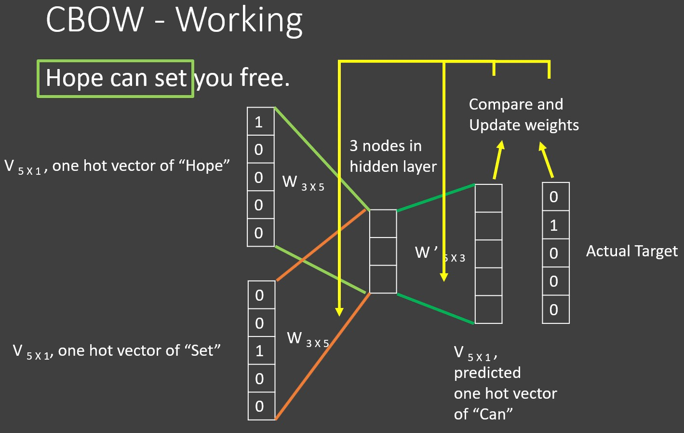
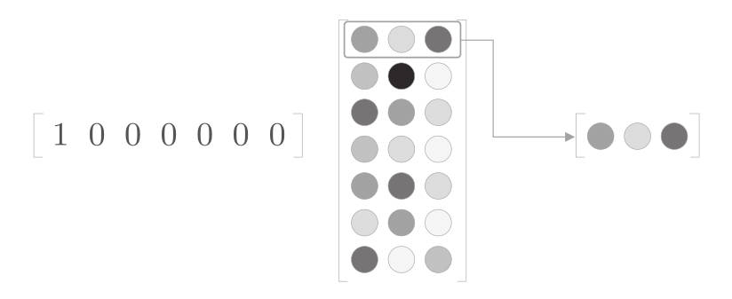
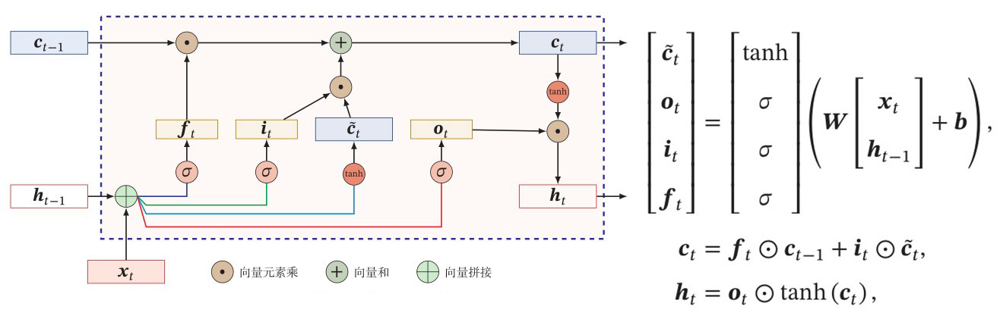
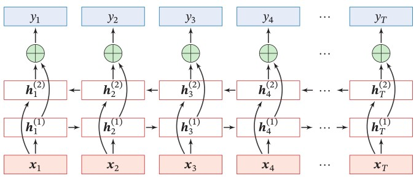
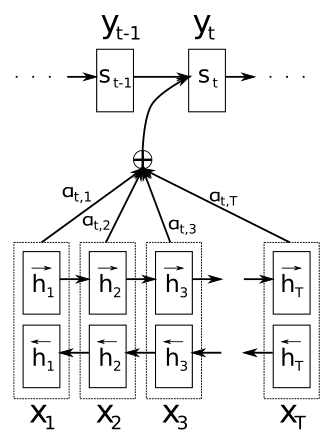
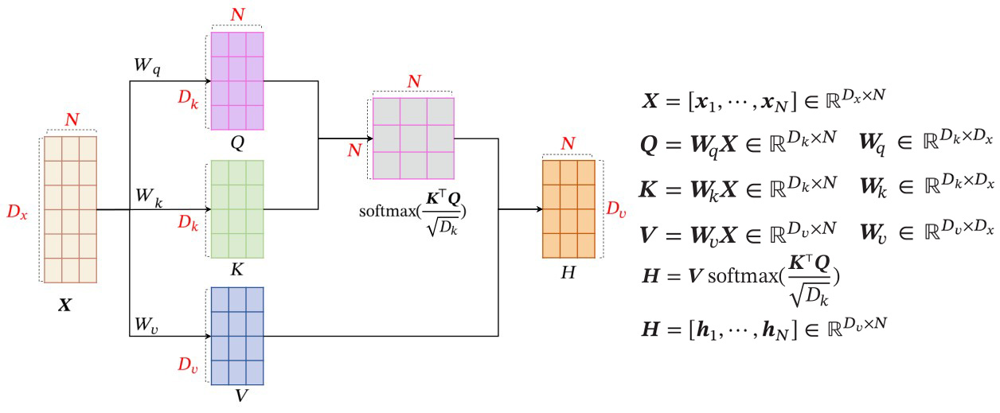
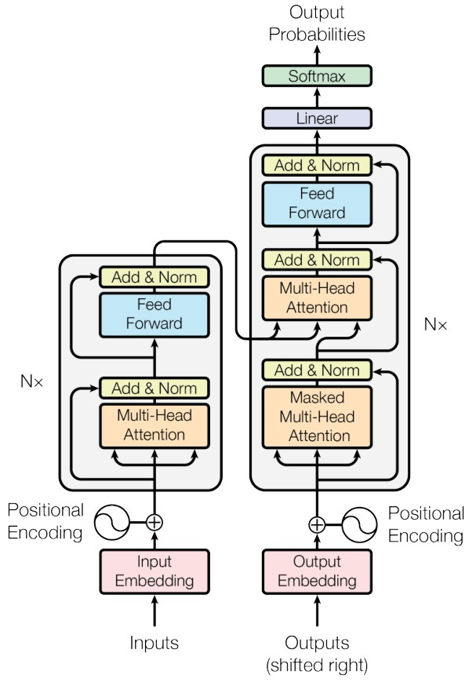
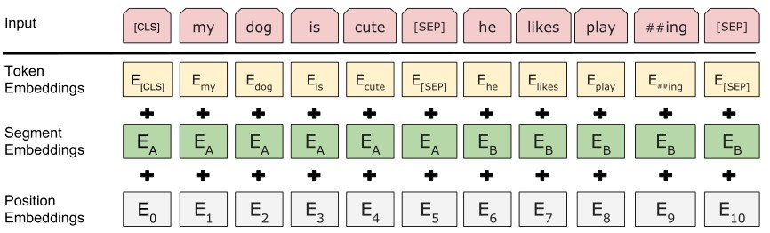

# Word Vector & Text Classification

为了将文本转换成计算机可理解的形式——由数字组成的向量，也被称为文本的特征向量，在NLP（Natural Language Processing，自然语言处理）的发展历程中诞生了许多方法。

在进行文本分类之前通常需要对文本进行预处理（Pre-processing）与分词（Tokenization）。预处理旨在减少原始文本中的杂讯，如剔除无意义的字符、将不同语言的Unicode变体字符进行规范化、剔除虚词等。分词旨在将文本切分为更小的块（token），以便解析出文本的内在语义。在中文中，或通过概率模型进行分词，或直接按字切分。在英文中或直接按空格切分，或通过概率模型进行sub-word的分词。另外也有按bytes进行切分的[^10fb52]。下述的"词"均指分词之后的token，鉴于本课题的研究方向，这里不对分词的方法进行细致阐述。

传统的文本分类方法大致可以分为两类：基于统计的特征（词袋、tf-idf），词嵌入-文本特征向量（Word2Vec+向量融合、Transformer的Encoder）。

BoW（Bag of Words，词袋），最直观的文本表征方式，仅仅抽取出了"词的存在"的信息：统计语料库中所有的词，构造出one-hot的词袋向量，即为文本的特征向量。

tf-idf（term frequency - inverse document frequency，词频-逆文档频率），在词袋的基础上加入了"词的频率"的信息：统计语料库中所有的词，对于一个词，在一段文本中出现的次数即为词频（term frequency），出现该词的文本在语料库文本总数的占比率的倒数（再取对数）即为逆文本频率（inverse document frequency），将两者相乘就是该词在一段文本内的tf-idf，计算出语料库中所有的词在该文本中的tf-idf，构成的向量即为该文本的特征向量。

词嵌入（Word Embeddings），指把维数为所有词的数量的离散的高维空间嵌入到一个维数低得多的连续向量空间的方法[^4d58ef]，这里低维的向量就被称作词向量（Word Vector），从而引入了语义的信息。

Word2Vec由Tomas Mikolov于2013年提出[^5d2826]，有CBoW（Continuous Bag of Words）和Skip-gram两种架构。之后的GloVe（Global Vectors for Word Representation）方法融合了基于推理和计数的方法，并将整个语料库的统计数据的信息纳入损失函数[^4ef255]。另外有研究把Word2Vec的理念扩展到文章上[^abb9d7]。

这种预训练（Pre-training）词向量的思想开启了用词向量产生文本向量的大门：把一段文本内的词向量经过平均（Average）、RNN（Recurrent Neural Network，循环神经网络）、CNN（Convolutional Neural Network，卷积神经网络）或注意力（Attention）等操作，即可提取出文本的特征向量。

注意力机制伴随着RNN处理Seq2Seq任务发展，催生出了完全基于自注意力模型、Encoder-Decoder架构的Transformer，后来BERT沿用了Transformer中的Encoder，实现了完全基于自注意力模型的、动态的、语境相关的词向量、语义向量提取器。

有了文本的特征向量后，就可以用各种机器学习或者深度学习的方法，构建出文本向量与文本类别之间的概率关系，从而实现文本分类。

另外也有用自回归模型（Autoregressive Model）生成类别的：用Transformer的Decoder直接生成类别的，如GPT[^2fbbce]；也有直接用整个Transformer的，Encoder处输入文本，拿Decoder输出的最后一个位置的隐藏层作为分类（属于迁移学习中的zero-shot），如BART[^7e3115]。

## Word2Vec、LSTM

因为CBoW和Skip-gram的原理几乎相同，这里仅介绍CBoW，见图5。

图5.CBoW[^c98ee4]

统计语料库中所有的词，构造出长度为N的one-hot的词表示法。构建三层神经网络，输入待预测词周围n个词的one-hot向量，分别与$W_{in}$相乘再相加得到隐藏层，再与$W_{out}$相乘得到长度为N的概率向量输出，将输出与待预测词的one-hot向量做比较计算loss，让神经网络学到"周围词与待预测词强相关"。又因为从输入层到隐藏层是在抽取$W_{in}$对应的向量，输入的词的one-hot向量与$W_{in}$相乘相当于在抽取$W_{in}$中的一行，就像查表一样（见图6），隐藏层的值就相当于是周围词的融合——待预测词的环境，而$W_{out}$是从环境到one-hot向量的映射。因此，经过大量的自监督训练后，$W_{in}$和$W_{out}$就具有了词的意义，一般把$W_{in}$当作词向量的字典[^5d2826]。

Word2Vec产出的词向量是静态的，没有语境的信息，因此没有一词多义的表征能力。

图6.CBoW的权重抽取 [^4ef255]

循环神经网络是一种具有环状网络结构的神经网络，这里所谓的环是一种形象的比喻，指的是同一个网络在依次处理输入的一段序列内的多个组分时的各个分身，每个分身的内部参数都是相同的，但是输入每个分身的数据是不同，在处理的序列中，靠后的分身除了要获取当前序列的样本外，还要获取靠前的分身的隐藏状态，并对两者进行融合，因此这种结构的网络便具有了短期记忆的能力，特别适合处理序列或时序数据[^e7cb9d]。我们可以用这种架构，依次输入文本中的词向量，从而提取出文本的语义。

然而由于这种独特的架构，每个分身的输入都依赖于前一个分身的输出，误差是呈幂级累积的，因此就存在着梯度消失或爆炸的问题。门控机制的提出缓解了这个问题，通过有选择地加入新的信息、有选择地遗忘之前的信息，来控制误差的累积速度[^e7cb9d]。LSTM（Long Short-Term Memory Network，长短期记忆网络）就是其中的一种。

通过设置参数由网络动态学习的遗忘门$f$、输入门$i$、候选状态$\widetilde{c}$、输出门$o$，来控制历史状态的记忆单元$c$和隐藏状态$h$影响当前输入的$x$，并输出新的$c$和$h$。换句话说，门机制能让循环神经网络学会上下文语境下哪些信息该丢弃，哪些需要继续传递下去。

图7. LSTM 网络的循环单元结构，门、隐藏层的计算[^e7cb9d]。其中$\sigma$为Sigmoid函数，输出的区间为(0,1)。

其中隐状态$h$是随着每次输入$x$实时变化的，是相对短期的记忆，而$c$融合了历史上所有的$x$、$h$、$c$，是相对长期的记忆，因此被称为长短期记忆网络[^e7cb9d]。一般选用$h$作为最终的输出，也就是文本的特征向量。

另外在RNN中引入双向性也被证明是有益的，并应用于LSTM取得了显着的成果（如ELMo）[^10fb52]。

图8. 双向LSTM[^e7cb9d]

## Attention、Transformer、BERT

有很多数据是以序列的形式存在，比如声音、语言、视频、DNA序列或者其他的时序数据等[^e7cb9d]。Seq2Seq（Sequence to Sequence）任务指序列到序列的映射。在NLP领域中包括机器翻译、文本摘要、聊天机器人、阅读理解和文章摘要等任务（广义上还可以有语音识别、图像描述生成和图像问答等）。

Seq2Seq任务的解决方法通常使用Encoder-Decoder架构，可以使用两个RNN网络，Encoder读入文本输出一个低维空间的向量，Decoder读入低维空间的向量与输出的结果直到触发终止条件为止。

然而RNN在Seq2Seq上存在许多问题：

1. 虽然循环网络理论上可以建立长距离依赖关系，但是由于信息传递的容量以及梯度消失问题，实际上也只能建立短距离依赖关系[^10fb52][^e7cb9d]。
2. 传统的Encoder-Decoder框架无法进行选择性的编码，某些信息在任务中具有较高的重要性（比如在翻译中许多有性数格的语言需要额外关注），同时又有某些信息与任务无关。
3. 由于循环神经网络的架构特性无法并行计算，因此对于非常长的序列意味着更高的时间复杂度[^e7cb9d][^61e60f]。

注意力机制（Attention Mechanism）最初被用作对各种体系结构的增强，旨在让学习过程专注于输入信息中更重要的部分（即给予它们"注意力"）[^10fb52]。2014年在Bahdanau 等人的研究中，通过对Encoder输出的隐藏层增加一个由神经网络自己学习出来的权重层（见图9），让神经网络自己决定输入Decoder的向量是由哪些词汇得出的（也就是注意力），从而缓解了RNN在机器翻译任务中的问题2[^270b8a][^d9b98d]。之后注意力机制便被广泛应用于对RNN处理Seq2Seq问题的优化上[^d9b98d]。

图9. Bahdanau的设计[^270b8a]

2017年Vaswani等人[^61e60f]提出了完全基于自注意力模型（Self-Attention Model）的Transformer架构（自注意力方法在之前也被用于RNN的优化中，Transformer是第一个抛弃RNN和CNN，将自注意力方法应用于序列到序列的映射的）。

自注意力模型利用查询-键-值（Query-Key-Value，QKV）的模式，将输入的序列中的各个向量利用Query-Key计算出自身在整个语境中的注意力，再将注意力与自己的Value相乘，得到对应的输出向量（见图10）。

图10. 自注意力模型的计算过程[^e7cb9d]

自注意力模型刚好能解决之前RNN在Seq2Seq上的痛点。从输入到输出的计算操作是在整个序列上进行的简单的矩阵运算，所以上述的问题1）与问题3）得以解决。序列到序列映射的权重是神经网络动态学习出来的，问题2）也得以解决。

Transformer同样是解决Seq2Seq问题的Encoder-Decoder架构（见图11），原始论文中在翻译任务上进行训练。

图11. Transformer[^61e60f]

训练时，Encoder处输入文本，通过Byte-Pair Encoding的sub-word分词方法，形成$n$个词袋中的token-id，将id序列通过Embedding层得到词向量（代码中Embedding层就是一个矩阵，输入索引，输出对应的行，不用one-hot这种浪费空间的表征形式），Encoder通过$N$个自注意力模型+对样本逐个操作的全连接网络（Position-wise Feed-Forward Networks）输出$n$个向量。

Decoder处为了更好的学习，输入的是正确的翻译文本（这被称为teacher forcing），经过同样的分词和与Encoder共享权重的Embedding。由于Decoder是自回归（autoregressive，和RNN一样输入依赖输出）的，为了有效的训练，需要Mask掉未预测的部分（通过在计算Query-Key的softmax之前加上一个负无穷，softmax之后出来的注意力就是0了），自注意的时候只会关注已经预测出的位置。还要先出入一个\[START\]标识符，以产生第一个输出。在Encoder的输出向量与Decoder的自注意向量融合的时候（$N$次融合），使用Decoder处的Query与Encoder输出处的Key、Value进行注意力计算。最后的输出通过同样与Embedding层共享权重的线性层（Ofir Press的研究表明输出处的线性层与输入处的Embedding进行权重绑定可以大幅减少模型的参数并且不会损害性能[^bed360]，这个技巧已经被广泛使用）映射回长度为$n$的空间，通过softmax形成一个长度为$n$的概率向量，与一个one-hot的token答案向量做比较计算loss[^61e60f]。

- 因为自注意力模型中没有语序的信息，引入了预先定义的位置编码（Positional Encoding）[^61e60f]，同时也可以体现出一句内同一个词在多个地方出现的区别[^10fb52]

- 利用多头注意力（Multi-Head Attention）允许模型共同关注来自不同表征空间、不同位置的信息[^61e60f]。这类似于CNN中的多通道机制，相当于分成了多个视角，然后每个视角都去进行Attention，这样模型的学习能力和潜力就会大大提升。

- 利用残差连接（Residual Connection）[^61e60f]，提高信息的传播效率，缓解深层网络梯度消失的问题[^e7cb9d]。

- 使用了大量的丢弃（Dropout）[^61e60f]，可以缓解过拟合[^e7cb9d]。

Transformer完美地解决了传统RNN、CNN在Seq2Seq任务上的问题，并在多种模态多种任务上均获得了最先进的（State-of-the-Art）的结果。它不仅造福了NLP届，同样也造福了CV、Audio、Video等原本也依赖于RNN和CNN的数据模态届，为Seq2Seq的天下提供了一统江湖的模型架构。由于Transformer的出色表现，越来越多的语言模型都基于Transformer或者对Transformer进行扩展[^e59e23]。

- Encoder：BERT, ALBERT, DistilBERT, ELECTRA, RoBERTa......

- Decoder：GPT, CTRL, GPT-2, Transformer XL......

- Encoder-Decoder：BART, T5, Marian, mBART......

研究人员认为，对于某些任务，它可能会在编码和解码阶段学习到冗余信息。在文本编码和生成文本的任务中，仅仅选取Encoder或Decoder可以获得等效的性能和更轻量的模型[^10fb52]。这些在广范围、大规模数据上预训练好的单一架构的模型就可以用迁移学习的方法过渡给下游的任务，这就是预训练+微调（Pre-training + Fine-tuning）的训练方法。并且由于Transformer的参数量很大，从零开始训练Transformer类模型并获得较好的效果往往需要大量的样本与训练时间，而使用Pre-training + Fine-tuning的方法可以在更短的时间内获得更好的效果，同时减少不必要的能源消耗[^e59e23]。

BERT（Bidirectional Encoder Representations from Transformers）由Devlin J等人于2018年提出。选用了Transformer中Encoder的架构，并增大了层数N、隐藏层宽度、多头注意力的个数。

同样是输入文本，但首先在开头加上\[CLS\]标识符，在句尾加上\[SEP\]标识符，用WordPiece法分词，得到token-id。Embedding由三种组分相加得到（其中权重都是学出来的）。其它结构与Transformer的Encoder相同[^e4ab5a]。

图12. BERT的三层Embedding[^e4ab5a]

- $Token Embeddings_{(vocab\_size=30000,\ hidden\_size=768)}$就是每个Token对应的Embedding，输入token-id序列的索引[^6daa80]

- $Segment Embeddings_{(token\_type\_vocab\_size=16,\ hidden\_size)}$是为了在之后的Next Sentence Prediction任务中区分前后句，输入类似`[0,0,0,1,1,1]`的索引[^6daa80]

- $Position Embeddings_{(max\_position\_embeddings=512,\ hidden\_size)}$是加入位置信息，输入`[0,1,2,\...,len(input)]`的索引[^6daa80]

为了让模型学到词的语义，设计了Masked LM任务。输入的时候按一定的概率用\[MASK\]标识符遮住某些token，让对应的输出长度为hidden_size的向量经过一个与Token Embedding层共享权重的线性层映射回长度为vocab_size的空间，通过softmax形成一个长度为vocab_size的概率向量，与一个one-hot的token答案向量做比较计算loss。

为了让模型学到句与句的关系，设计了Next Sentence Prediction任务。即输入两个句子，用\[SEP\]分开（这就是Segment Embeddings的0\\1索引的分界线），把\[CLS\]对应的输出传入一个线性层和softmax，输出长度为2的概率向量，与是否是Next Sentence的one-hot答案向量作比较计算loss。

因为\[CLS\]本身没有语义，也总是出现在第一个位置，所以它相当于是无差别地对之后的所有token进行关注，这个位置输出的向量就具有了整个句子的语义（在实际的应用中还要经过一个线性层和一个Tanh激活函数，被称为pooled_output）。而其他各个位置的输出，就是每个token在语境中的语义。

综上所述，我们可以利用纯Attention的结构获得动态生成的、语境相关（支持一词多义）的词向量（Contextual Embedding），以及文本的特征向量。

BERT原始的功能可以很好地进行填词，判断上下句是否衔接，产出token的语义、句的语义。如果对输出层进行特定的抽取，在其他NLP问题上微调训练，也可以获得十分不错的成绩。

# Reference

[^10fb52]: Gasparetto Andrea et al. A Survey on Text Classification Algorithms: From Text to Predictions\[J\]. Information，2022，13(2)：83-83.

[^4d58ef]: 维基百科. 词嵌入 \[EB/OL\]. https://zh.wikipedia.org/wiki/词嵌入，2022

[^5d2826]: Tomas Mikolov et al. Efficient Estimation of Word Representations in Vector Space\[J\]. CoRR，2013，abs/1301.3781

[^4ef255]: 斋藤康毅. 深度学习进阶：自然语言处理\[M\].北京:人民邮电出版社，2020：100-126

[^abb9d7]: Quoc V. Le，Tomas Mikolov. Distributed Representations of Sentences and Documents\[J\]. arXiv preprint arXiv:1405.4053，2014

[^2fbbce]: Radford A，Narasimhan K，Salimans T. Improving language understanding by generative pre-training\[J\]. 2018.

[^7e3115]: Mike Lewis，Yinhan Liu，Naman Goyal，Marjan Ghazvininejad，Abdelrahman Mohamed，Omer Levy，Ves Stoyanov，Luke Zettlemoyer. BART: Denoising Sequence-to-Sequence Pre-training for Natural Language Generation，Translation，and Comprehension\[J\]. arXiv preprint arXiv:1910.13461，2019

[^cea704]: Beyza Ermis，Giovanni Zappella，Martin Wistuba，Aditya Rawal，Cedric Archambeau. Memory Efficient Continual Learning with Transformers\[J\]. arXiv preprint arXiv:2203.04640，2022

[^2654eb]: Marko Zeman，Jana Faganeli Pucer，Igor Kononenko，Zoran Bosni. SuperFormer: Continual learning superposition method for text classification\[J\]. Neural Networks，2023

[^9f3909]: Jun-Yan Zhu，Taesung Park，Phillip Isola，Alexei A. Efros. Unpaired Image-to-Image Translation using Cycle-Consistent Adversarial Networks\[J\]. arXiv preprint arXiv:1703.10593，2017

[^c98ee4]: The Semicolon. Word2Vec - Skipgram and CBOW \[EB/OL\]. https://www.youtube.com/watch?v=UqRCEmrv1gQ，2018

[^e7cb9d]: 邱锡鹏. 神经网络与深度学习\[M\]. 北京: 机械工业出版社，2020

[^61e60f]: Vaswani，Ashish. Attention is all you need.\[J\]. Advances in neural information processing systems，2017，30

[^270b8a]: Dzmitry Bahdanau，Kyunghyun Cho，Yoshua Bengio. Neural Machine Translation by Jointly Learning to Align and Translate.\[J\]. CoRR abs/1409.0473，2014.

[^d9b98d]: Allohvk. What\'s the difference between Attention vs Self-Attention? What problems does each other solve that the other can\'t? \[EB/OL\]. https://datascience.stackexchange.com/a/85999，2020

[^bed360]: Ofir Press，Lior Wolf. Using the Output Embedding to Improve Language Models\[J\]. arXiv preprint arXiv:1608.05859，2016

[^e59e23]: Hugging Face. How do Transformers work? \[EB/OL\]. https://huggingface.co/course/chapter1/4，2023

[^e4ab5a]: Devlin J，Chang M W，Lee K. Bert: Pre-training of deep bidirectional transformers for language understanding\[J\]. arXiv preprint arXiv:1810.04805，2018

[^6daa80]: google-research. bert/modeling.py \[CP/OL\]. https://github.com/google-research/bert/blob/master/modeling.py，2020

[^5ecfcb]: Li S，Zhao Z，Hu R. Analogical reasoning on chinese morphological and semantic relations\[J\]. arXiv preprint arXiv:1805.06504, 2018.

[^61b65f]: fxsjy. jieba \[CP/OL\]. https://github.com/fxsjy/jieba，2020

[^d1f352]: Thomas Wolf，Lysandre Debut，Victor Sanh，Julien Chaumond，Clement Delangue，Anthony Moi，Pierric Cistac，Tim Rault，Remi Louf，Morgan Funtowicz，Joe Davison，Sam Shleifer，Patrick von Platen，Clara Ma，Yacine Jernite，Julien Plu，Canwen Xu，Teven Le Scao，Sylvain Gugger，Mariama Drame，Quentin Lhoest，Alexander Rush. Transformers: State-of-the-Art Natural Language Processing\[J\]. Association for Computational Linguistics，2020，2020.emnlp-demos.6: 38--45

[^927c22]: Yiming Cui，Wanxiang Che，Ting Liu，Bing Qin，Ziqing Yang. Pre-Training With Whole Word Masking for Chinese BERT\[J\]. IEEE/ACM Transactions on Audio，Speech，and Language Processing，2021，vol. 29: 3504-3514

[^18bcd0]: Gabriele Graffieti，Davide Maltoni，Lorenzo Pellegrini，Vincenzo Lomonaco. Generative Negative Replay for Continual Learning\[J\]. arXiv preprint arXiv:2204.05842，2022

