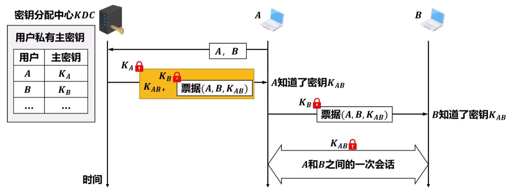

前情提要：Bob想给Alice发信，Eve是中间人

# 对称加密

DES、AES、ChaCha

互相用同一个密钥加密、解密

## 密钥分发——KDC

和朋友分发密钥困难，线下碰头商量密钥太low了

密钥分发中心 KDC (Key Distribution Center) 和各个用户共享一对主密钥，当A和B要进行加密通信时，通过下图的方式获得 session key $K_{AB}$。



> 最初主密钥是如何与各个用户分发的，难道还是得通过非对称加密的通信❓

# 非对称加密

RSA

- 公钥和私钥成对出现，公钥和私钥是相对的，两者本身并没有规定哪一个必须是公钥或私钥。公开的密钥叫公钥，只有自己知道的叫私钥。
- 用公钥加密的数据只有对应的私钥可以解密；用私钥加密的数据只有对应的公钥可以解密
- 如果可以用公钥解密，则必然是对应的私钥加的密；如果可以用私钥解密，则必然是对应的公钥加的密

> [!NOTE]
>
> Hybrid：非对称加密 + 对称加密
>
> “非对称加密”的速度较慢，而对称加密分发不方便密钥。
>
> 可以用“非对称加密”分发“对称加密”的密钥，并获得“对称加密”算法的高效。
>
> 这点被运用于TLS的密钥交换算法中，见《计网》的“网络安全”。

## 给某人发加密信息

Bob用Alice的公钥加密，传输过去，Alice用自己的私钥解密

## 给世界发加密信息

Bob用自己的私钥加密，传播到全世界，只能用Bob的公钥打开

## 密钥分发——证书

非对称加密存在中间人的问题：可能Bob拿到的Alice的公钥不是真正的，而是被Eve偷换过的？那么你拿Eve的公钥加密，发出后Eve就可以用自己的私钥解密。

如果Alice和Eve同时在网上说自己是Alice，那么Bob分不清到底谁才是真正的Alice。

就只能找一种权威中心（国家机构、大企业，权威就权威在CA的私钥不容易泄露），叫“证书中心”（Certificate Authority, CA），公众用自己的真实的社会信息去证明我是我，我的这串公钥是我的，CA就要记录下来，并把你的个人信息和公钥的明文经过“CA的私钥”的加密，做成“数字证书”（Digital Certificate）。


这些证书公开于众，世界上任何人拿“CA的公钥”解密，就能得到证书中真实的公钥。


> CA和DNS服务器一样也是分层的，有一个根CA，然后是1级CA、2级CA，下级的CA证书由上级的分发，根CA应该被默认信任

## Diffie-Hellman Key Exchange

可以在不安全的公共信道中，通过交换两个参数，获得一个外界无法计算得到的“对称加密”密钥。

但是无法排除中间人攻击的危险，所以必须对交换的参数进行签名。（不需要对参数加密，只需要确定信息确实是来自对方即可）

# 加密散列函数

Cryptographic Hash Function

摘要（digest）：数据的Hash值

> digest的一些别名
>
> checksum, error detection code, hash, keyed hash, message authentication code, protected checksum

知名算法：MD5、SHA

应用：验证完整性(integrity)

- 辅助非对称加密的签名

- 验证密码：不要存储明文密码，而是存储密码的Hash值

  > 以前做软件时啥都不懂，自己发明的验证密码的方法：
  >
  > 存的是`bytes = AES_Encrypt(key, key)`
  >
  > 用`AES_Decrypt(bytes, key) == key`来验证密码🤣

- 用于Map (Dict)、Set，因为它是极其优秀的Hash函数

# 鉴别

想要在传输信息后，能证明是我发出的信息(authentication)，且保证信息没被篡改(integrity)。如果只是把digest附在信息外传输，中间人完全可以把信息和digest都替换掉，那就糟糕了。

> 这里还不是人人都有网站能正确发布digest值的年代

## 通过对称加密

收发方需要事先商量密钥

直接加密整个信息的话，将十分浪费计算资源，而且没有保密性的需求啊！

### MAC

设计一种混入密钥的函数，得到简短的MAC (Message Authentication Code)。


### HMAC

利用[加密散列函数](#加密散列函数)，直接把密钥和信息以某一种固定格式存储，然后计算出整体的digest，附在信息外传输。


## 通过非对称加密

### 签名(Signature)

将自己的文件经过[加密散列函数](#加密散列函数)得到摘要（Digest），再用自己的私钥加密，这就是签名，附在文件外一并传输。


别人只能用我的公钥解密签名，并且得到的结果就是文件的Hash值


- 如果签名被修改了，那么解密会失败；
- 如果文件被修改了，那么计算出来的Hash值将会不一致；

### 签名+加密

❌ 先加密后签名，存在被劫持的风险：捣乱的人可以把签名撕下来，然后贴上自己的签名（当然密文是不可能泄露的，只不过本次对话就失效了）


✅ 先签名后加密，完美！


给某人发加密信息时，先签名，再查到ta的证书中的真实公钥以加密，也可以顺便附上自己的证书。

收到带有证书的信息：

- 如果证书被替换成其他人的证书，那么证书中的信息将不匹配，且用错误的公钥将会导致验证签名失败
- 签名不可能被修改，因为中间人无法解密
- 文件不可能被修改，因为中间人无法解密

# GPG

OpenPGP的一种实现

```bash
bash
gpg --full-generate-key

# list public keys
gpg --fingerprint -k --keyid-format long
# list private keys
gpg --fingerprint -K --keyid-format long
```

导出、导入private key即可备份

```bash
# export
gpg -ao private.asc --export-options backup --export-secret-keys UID

# import
gpg --import-options restore --import private.asc
gpg --edit-key UID
> gpg trust
5 = I trust ultimately
Your decision? 5
> gpg quit
```

建议为每个事务建立专用的subkey，比如git的commit sign，只需要导出这个subkey的public key放到Github的setting里，导出这个subkey的private key到写代码的电脑里并导入到gpg里，并配置git

```cmd
# 导出（感叹号表示仅导出选定的key）
gpg -ao sign-public-key.asc --export [SUBKEY ID]!
gpg -ao sign-private-key.asc --export-secret-subkeys [SUBKEY ID]!

# 导入到新电脑
gpg --import sign-private-key.asc
# edit trust
gpg --edit-key UID
> gpg trust
# 指定signingkey
git config --global user.signingkey [SUBKEY ID]!
# allway sign
git config --global commit.gpgsign true
```

推荐阅读：

- [2021年，用更现代的方法使用PGP](<https://ulyc.github.io/2021/01/13/2021年-用更现代的方法使用PGP-上/>)
- [「译」PGP的问题](https://ulyc.github.io/2022/09/05/tr-pgp-problem-1/)
