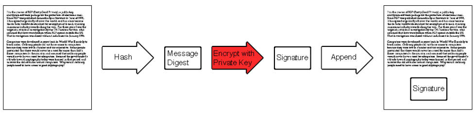
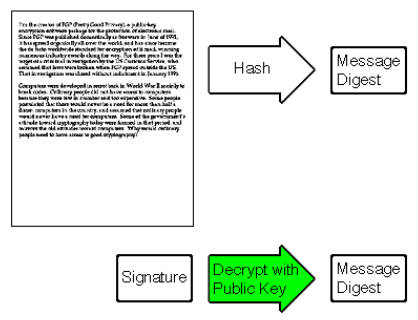
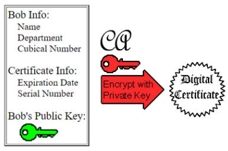
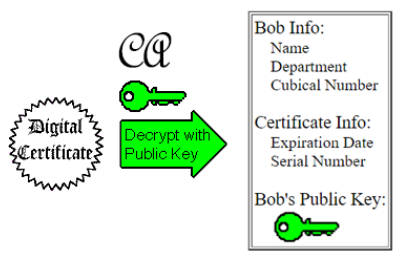

# 对称加密

DES、AES、ChaCha

应用：

- 加密信息：互相用同一个密钥加密、解密

缺点：

- 和朋友分发密钥困难，线下碰头商量密钥太low了

# 非对称加密

RSA

- 公钥和私钥成对出现，公钥和私钥是相对的，两者本身并没有规定哪一个必须是公钥或私钥。公开的密钥叫公钥，只有自己知道的叫私钥。
- 用公钥加密的数据只有对应的私钥可以解密；用私钥加密的数据只有对应的公钥可以解密
- 如果可以用公钥解密，则必然是对应的私钥加的密；如果可以用私钥解密，则必然是对应的公钥加的密

## 给某人发加密信息

用对方的公钥加密，传输过去，对方用自己的私钥解密

> [!NOTE]
>
> 非对称加密 + 对称加密
>
> “非对称加密”的速度较慢，可以用“非对称加密”传输“对称加密”的密钥，从而解决了“对称加密”分发密钥的困难。

## 给世界发加密信息

用自己的私钥加密，传播到全世界，只能用我的公钥打开

## 签名(Signature)

能确保发件人是我，并且能确保完整性

将自己的文件经过[加密散列函数](#加密散列函数)得到摘要（Digest），再用自己的私钥加密，这就是签名，附在文件外一并传输。




别人只能用我的公钥解密签名，并且得到的结果就是文件的Hash值



- 如果签名被修改了，那么解密会失败；
- 如果文件被修改了，那么计算出来的Hash值将会不一致；

## 签名+加密

✅ 先签名后加密，完美！


❌ 先加密后签名，存在被劫持的风险：捣乱的人可以把签名撕下来，然后贴上自己的签名（当然密文是不可能泄露的，只不过本次对话就失效了）


## 证书

但给某人发加密信息时，依旧存在中间人的问题：可能你拿到的收件人的公钥不是真正的，而是被中间人偷换过的？那么你拿中间人的公钥加密，发出后中间人就可以用自己的私钥解密。

就只能找一种权威中心（国家机构、大企业，权威就权威在CA的私钥不容易泄露），叫“证书中心”（Certificate Authority, CA），专门存储大家的公钥（以及附带真实的个人信息，为了在销毁公钥时进行核查）。这些信息的明文经过“CA的私钥”的加密后就成了“数字证书”（Digital Certificate）。



这些证书公开于众，世界上任何人拿“CA的公钥”解密，就能得到证书中真实的公钥。



给某人发加密信息时，查到ta的证书中的真实公钥以加密，再签名，也可以顺便附上自己的证书。

收到带有证书的信息：

- 如果证书被替换成其他人的证书，那么证书中的信息将不匹配，且得到的公钥验证签名失败
- 如果签名被修改了，那么解密会失败；
- 如果文件被修改了，那么计算出来的Hash值将会不一致；

---

HTTPS用的TLS（SSL是旧版本）就用到了证书，网站服务器会发来它的证书。电脑中会预先安装一些世界知名CA的证书，也就是CA的公钥，如果能用某个CA公钥解开证书，并且该证书的信息与该网站匹配，那么就可以用该网站的公钥协商接下来对称加密要用的密钥。


# 加密散列函数

Cryptographic Hash Function

MD、SHA

摘要（digest）：数据的Hash值

应用：验证完整性(integrity)

- 辅助非对称加密的签名

- 验证密码：不要存储明文密码，而是存储密码的Hash值

  > 以前做软件时啥都不懂，自己发明的验证密码的方法：
  >
  > 存的是`bytes = AES_Encrypt(key, key)`
  >
  > 用`AES_Decrypt(bytes, key) == key`来验证密码🤣

- 用于Map (Dict)、Set，因为它是极其优秀的Hash函数

# GPG

```bash
bash
gpg --full-generate-key
```

Backup

```bash
# export
gpg -o private.gpg --export-options backup --export-secret-keys email@gmail.com

# import
gpg --import-options restore --import private.gpg
gpg --edit-key email@gmail.com
> gpg trust
5 = I trust ultimately
Your decision? 5
> gpg quit
```

# Reference

[1]: https://blog.csdn.net/u014419512/article/details/84600463	"数字签名与数字证书技术简介"

