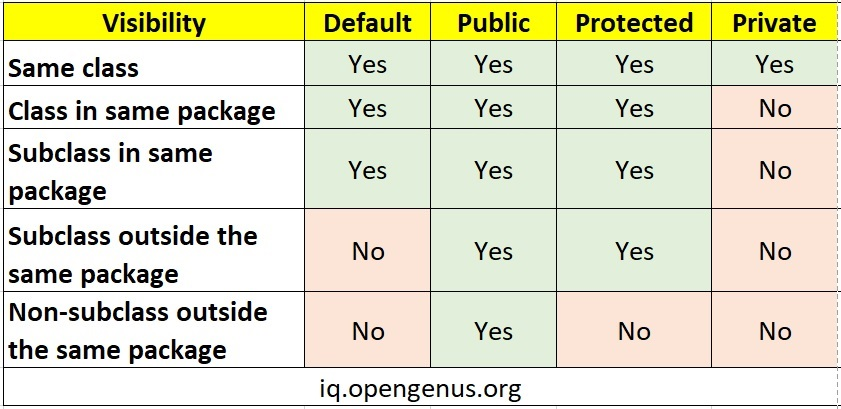

# Object Oriented

## Class/Instance

Java对面向对象作了十分严格的限制

staic：Class attribute/method

non-static：Instance attribute/method

Class无法访问Instance专有的东西

## Inheritance

Subclass is-a Hyperclass

### Interface Inheritance

先定义一种东西（interface）能干的事情（method），比如列表。

有许多种Subclass能implement这些事情，比如线性表、链表。

一堆Subclass都能干相同的method，且必须能干所有Interface中规定的method（可多干，不能少干）

```java
public interface Animal{
    public void eat();

    // Interface Inheritance中也可以Implement Inheritance
    // 这里指定默认的method，然后在Subclass中Override
    default public void speak(){
        System.out.print("I'm animal");
    }
}
```

```java
public class Dog implements Animal{
    @Override
    public void eat(){ // Override 重写了interface
        System.out.print("umum");
    }
    
    // 这里不能写@Override
    public void eat(Cat x){ // Overload 重载了Dog.eat()
        System.out.print("woof");
    }
    
    @Override
    public void speak() {
        System.out.print("I'm dog");
    }
}

public class Pig implements Animal{
    @Override
    public void eat(){ // Override 重写了interface
        System.out.print("oink");
    }
    
    @Override
    public void speak() {
        System.out.print("I'm pig");
    }

    public void sleep(){
        System.out.print("ghumm");
    }
}
```

> `@Override`的作用：只是一个标志，如果method不是Overide，那么会报错。也就是让你implement东西的时候搞清楚哪个是哪个，并帮助其他开发者方便地看出哪个是哪个。

### Implement Inheritance

在一种SuperClass的基础上写SubClass，Override了原有的method，或新增了更多的method

```java
public class FatPig extends Pig{
	public FatPig(){
        super();
        ...
    }
    
    @Override
    public void sleep(){
        System.out.print("gumm...humm...");
    }
    
    public void sleepALot(){}
}
```

> 不明智的做法：
>
> - 在Subclass中定义与SuperClass相同的variable

### Dynamic Type

在Interface Inheritance中

```java
public class Zoo {
    public static void fetchStick(Animal a) {
        System.out.print("Fetch");
    }

    public static void main(String[] args) {
        // 可以把Subclass的类型存储在Interface/SuperClass的指针中
        Animal dog = new Dog();
        dog.eat();
        fetchStick(dog);

        Dog doggy = new Dog();
        doggy.eat();
        // 也可以把Subclass的指针传入需要Interface/SuperClass
        // 作为参数的函数中
        fetchStick(doggy);
    }
}
```

在Implement Inheritance中，如果定义指针类型为SuperClass，指向的却是SubClass的Instance，那语法检查的时候，会按照SuperClass的能力去检查（使用SubClass多出的或Overload的能力，语法检查会报错）。如果语法检查无误，实际执行的时候还是会根据run-time type来决定执行哪个。

```java
Pig fat = new FatPig();

fat.sleepALot();
// compile-time type 认为是Pig类型，Pig类型里没有sleepALot()，语法检查报错

fat.sleep();
// compile-time type 认为是Pig类型，Pig类型里有sleep()
// run-time type 是FatPig，会执行FatPig.sleep()
```

---

Type Cast的正确使用，可以消除语法报错

但错误的使用，`Dog dog = new (Dog) Animal();`即使欺骗了语法检查，但编译的时候依旧会错

## Overload Operator

Java中为了代码简洁、易读，不允许重载运算符

想要提供比较大小的method，需要继承Comparable

```java
public class Dog implements Comparable<Dog>{
	@Override
	public int compareTo(Dog o) {
		// 自身获胜，返回正数；
		// 平局，返回0
		// 对方获胜，返回负数
		return this.size-o.size;
	}
}
```

或者自身定义多种内置的Comparator，或在外部自定义临时的Comparator

## Controlling Access



# 指针

[Visualize Java Code](https://pythontutor.com/java.html)

和Python一样，两种变量类型：

- Primitive Type: `byte` `short` `int` `long` `float` `double` `boolean` `char`

  直接存储数据

- Reference Type: 存储指向Array、String、Object等的指针

  > 其实也可以把String看作Primitive Type，因为String不可分，无法修改自身，想要修改只能新建String重新赋值。所以不要在循环中构造String，而是循环构造列表，再`String.join(", ", list);`

---

赋值操作：

- Primitive Type: 复制值
- Reference Type: 复制地址

传入函数的值，将形参赋值为：

- Primitive Type: 值

- Reference Type: 地址

  - 传一个列表进去，然后修改列表

  - 传一个Instance进去，然后修改Instance的属性

# 细节

1. `==`比较的是地址；

   `.equals()`比较的是内容，你自己的类需要Override这个函数，否则默认比较的是地址。

2. String和其他类型的相加，Java默认帮你添上了`.toString()`

3. 